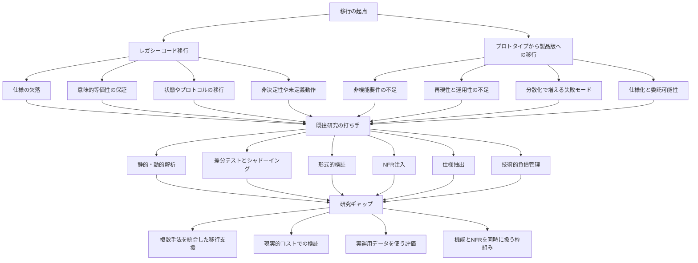
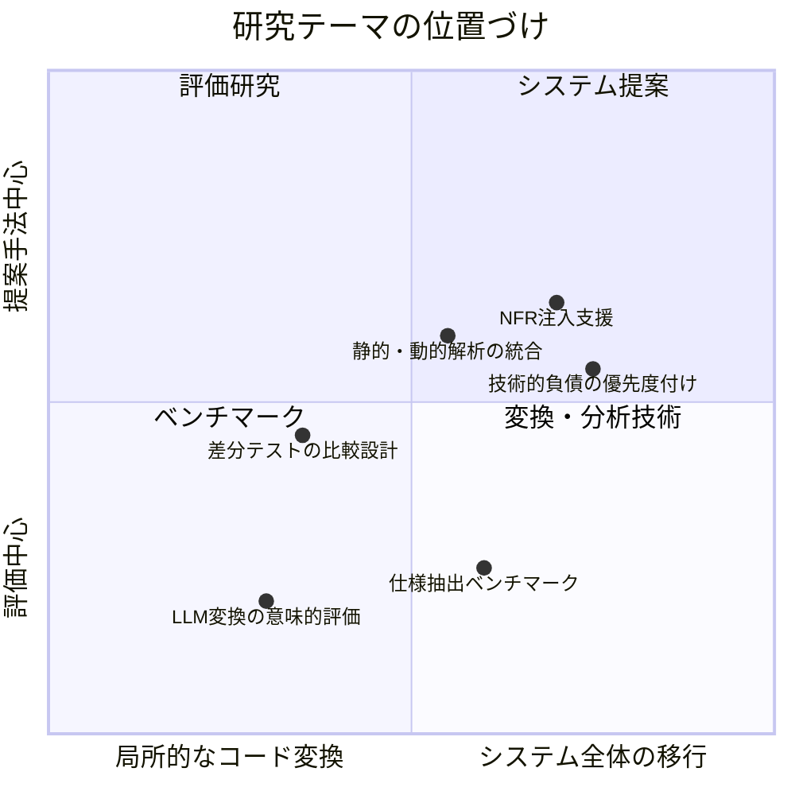

## 序論
## 研究提案に向けた論点整理

### 全体像

### 整理が必要な観点

- 対象をどこまでに限定するか: C/C++からRustへの移行、モノリス分割、ROS1からROS2、Notebookから本番ML基盤など
- 何を成功とみなすか: 機能等価性、性能改善、障害率低下、仕様抽出精度、移行工数削減など
- 評価対象を何で測るか: ベンチマーク、実システム、OSS、社内履歴、運用ログ、トレースデータ
- 提案手法の粒度をどこに置くか: 分析手法、支援ツール、評価指標、移行プロセス、LLM＋検証の統合パイプライン
- 現場導入の制約をどう扱うか: 完全自動化を目指すのか、人間参加型を前提にするのか

### 研究ギャップの見取り図

- 静的解析、動的解析、差分テスト、形式的検証は個別には研究が進んでいるが、それらを移行プロセスとして一貫接続する研究はまだ少ない
- 形式的検証は強力だが高コストで、巨大システムや実務上の制約下でどこまで適用可能かが未整理
- シャドーイングや差分テストは実務的だが、状態を持つ処理、非決定性、外部副作用を含むケースでは比較設計が難しい
- LLMを使った変換は増えているが、変換後コードの妥当性をどの粒度で保証するかという評価設計が未成熟
- プロトタイプから製品版への移行では、機能保持だけでなくNFR注入や運用性向上まで含めて評価する枠組みが弱い

## マイグレーション
### 発生する場面

- 古いC/C++で書かれた組み込みシステムをRustに置きかえ
- オンプレミス環境で動作する巨大モノリスシステムを、クラウドのマイクロサービスに分割して置き換える

### 技術的な課題

- 既存コードに仕様書がなく、どの分岐や例外処理が業務上必須なのかを人手で追い切れない
- 長年の改修で暗黙知がコードに埋め込まれており、移行単位やサービス境界をどこで切るべきか判断しにくい
- 本番でしか現れない入力パターンや運用上の回避ロジックが多く、テストケースだけでは現行挙動を十分に再現できない
- 乱数、時刻、スレッド実行順、外部I/Oなどの非決定性があり、新旧比較で何を差分と見なすべきかが難しい
- C/C++特有の未定義動作、ポインタ操作、共有メモリ、割り込み処理が、Rustや分散サービスにそのまま写像できない
- 移行対象が状態を持つシステムの場合、コード変換だけでなくデータ形式・永続化状態・通信プロトコルの整合も同時に満たす必要がある
- LLMでコード変換を高速化できても、生成コードが意味的に等価か、境界条件まで含めて保証しにくい

### 既往研究での取り上げ方

#### リバースエンジニアリング
- ドキュメントがない状態から、ソースコードの静的解析（構文木や依存関係グラフ）や動的解析（実行時のログ）を用いて、隠れたビジネスロジックや仕様を自動で抽出・可視化する研究

#### 等価性の検証

- 「書き換え前後で入力に対する出力が完全に一致すること」が唯一の品質担保の拠り所になります。そのため、既存のシステムから自動で大量のテストケースを生成し、新旧システムを並行稼働させて結果を比較する手法（シャドーイングなど）

#### AI/LLMによる変換

- LLMを使って古いコードを新しい言語に翻訳する研究が増えており、「AIが生成したコードが、元の複雑な仕様を本当に破壊していないか」をどう数学的・テスト的に証明する研究に注目がある

### リバースエンジニアリング（静的・動的解析による仕様抽出）

#### 静的解析（Static Analysis）アプローチ

- ソースコードの抽象構文木（AST）や、Gitなどのバージョン管理システムの変更履歴（コミットログ）をグラフ化し、頻繁に同時に変更されるクラス群を「一つのマイクロサービス候補」としてクラスタリングする手法

#### 動的解析（Dynamic Analysis）アプローチ
- 実行時のログやトレース情報（メソッドの呼び出し頻度やデータフロー）をキャプチャし、実際のワークロードに基づく依存関係を可視化

#### 静的解析アプローチ

##### ASTとコード依存グラフの活用

- Extraction of Microservices from Monolithic Software Architectures (Mazlami et al., 2017)
  - モノリスのコードベースと変更履歴から結合度グラフを生成し、グラフクラスタリングを用いてマイクロサービスの境界を自動提案する研究。

##### バージョン管理履歴（Git co-change）アプローチ

- From Monolith to Microservices: Static and Dynamic Analysis Comparison (Andrade et al., 2022)
  - オープンソースのモニタリングツール（Kiekerなど）を用いて、静的解析と動的解析を組み合わせた場合の効果を比較・検証する

- Monolith Development History for Microservices Identification: a Comparative Analysis ( Lourenc¸o et al., 2022)
  - Gitログのコマンドで全コミット履歴を取得し、ファイル間の共変動を定量化する

#### 動的解析アプローチ

- From Monolith to Microservices: Static and Dynamic Analysis Comparison (Andrade et al., 2022)
    - オープンソースのモニタリングツール（Kiekerなど）を用いて、静的解析と動的解析を組み合わせた場合の効果を比較・検証しています。

- Microservice Decomposition via Static and Dynamic Analysis of the Monolith
  - 静的解析だけでは発見できない境界を**ランタイムの実行トレース**で補う手法を提案
  - 使用ツールは **ExplorViz**（3Dシティメタファーによるソフトウェア可視化ツール）

### 等価性の検証

#### 動的な等価性検証

- 実稼働環境のトラフィックをコピーして新旧システムに流し、出力を比較する「シャドーイング」のアプローチ

#### 静的・数学的な等価性検証（シンボリック実行 / 形式的検証）

- C/C++からRustへの移行など、LLM（AI）によるコード変換が本当に仕様を破壊していないかを「テストケースの実行」ではなく「数学的な数式」として証明する、現在最もホットな研究領域です。

##### 動的な等価性検証（シャドーイング / ディファレンシャルテスト）

実稼働環境のトラフィックをコピーして新旧システムに流し、出力を比較する「シャドーイング」のアプローチです。

- Diffy: Testing Services Without Writing Tests** (Khanduri et al., Twitter, 2015)
  - マイクロサービスへの移行や大規模なリファクタリング時における「シャドーイング」を語る上で欠かせない、事実上の原典とも言える技術文献（およびオープンソースツール）です。本番トラフィックをマルチキャストして新旧両方のサービスに流し、レスポンスの差分を比較します。その際、タイムスタンプやランダム生成IDといった「システムごとに必然的にズレる無視すべきノイズ」を自動で除外して、純粋なビジネスロジックの非互換性だけを検出する手法を確立しました。

- zero-touch transformation: AI-driven middleware for autonomous integration of legacy enterprise systems with cloud architectures** (2025)
   - メインフレームなどの巨大なレガシーモノリスをクラウドアーキテクチャ（マイクロサービス）へ移行する際、AI主導のミドルウェアを用いてディファレンシャルテスト（新旧システム間での差分テスト）を行い、多様な入力条件に対する機能的等価性を検証するアプローチについて論じています。

##### 静的・数学的な等価性検証（シンボリック実行 / 形式的検証）

C/C++からRustへの移行など、LLM（AI）によるコード変換が本当に仕様を破壊していないかを「テストケースの実行」ではなく「数学的な数式」として証明する、現在最もホットな研究領域です。

- RustAssure: Differential Symbolic Testing for LLM-Transpiled C-to-Rust Code (2025)
    - LLMがC言語から自動変換したRustコードの正しさを保証する最新の重要論文です。具体的な値を与えてテストするのではなく、「シンボリック実行（入力を具体的な値ではなく記号として扱う手法）」を用いてCとRust双方のプログラムが取り得るすべての実行パスを網羅・数式化し、両者が意味的に完全に等価であるかを数学的に検証（Differential Symbolic Testing）する枠組みを提案しています。

- **Heimdall: Formally Verified Automated Migration of Legacy eBPF Programs to Rust** (2026)
  - LLMによるC言語からRustへの自動翻訳パイプラインにおいて、「angr」や「Z3」といった高度な数理検証ツール（SMTソルバ）を用いたシンボリック実行を組み込んだ研究です。コンパイルエラーを直すだけでなく、移行前後のプログラムがバイトコードレベルで完全に等価であることを形式的（数学的）に証明（Formal Verification）しており、安全なRust移行の決定版として注目を集めています。

### AI/LLMによる変換と「意味的等価性」の証明

最も注目を集めている最先端の領域です。LLMはコードを「翻訳」できますが、それが「元の複雑な仕様を破壊していないか」を保証できないという大きな課題があります。そのため、現在の研究は「構文の類似度（BLEUスコアなど）ではなく、プログラムの意味的等価性（Semantic Equivalence）をどう評価・証明するか」にシフトしています。

#### LLMの意味的推論能力のベンチマーキング

- EquiBench: Benchmarking Code Reasoning Capabilities of Large Language Models via Equivalence Checking (Wei et al., 2025)

  - LLMが「2つのプログラムがすべての入力に対して全く同じ出力を生成するか（等価性チェック）」を推論できるかを評価するベンチマーク。単純な構文の書き換えではなく、コンパイラの最適化やアルゴリズムの変更を経たコード同士の等価性をLLMが判定できるかを検証しています。

#### テストベースから「形式的検証（Formal Verification）」への回帰

- LLM-Based Code Translation Needs Formal Compositional Reasoning (OpenReview, 2024-2025)

- Beyond BLEU: A Semantic Evaluation Method for Code Translation (Näumann et al., 2026)
  - LLMが生成したコードの正しさをテストだけで証明するのは限界があるとし、形式手法（数学的な証明）やコンパイラテストの技法をLLMの翻訳プロセスに組み込むアプローチです。単なる統計的翻訳機ではなく、検証ツール（定理証明器など）とLLMを協調させることで、変換の安全性を保証する方向に進んでいます。

### この節から作れそうな研究テーマ

- 静的解析と動的解析を統合し、移行単位の候補提示から等価性確認までを一気通貫で支援する枠組み
- シャドーイングで観測した差分のうち、ノイズと本質的非互換を自動分類する比較手法
- LLM変換コードに対し、シンボリック実行やテスト生成を段階的に適用して保証コストを下げる検証パイプライン
- 状態遷移やプロトコル変換を含む移行で、コード単体ではなくシステム全体の整合性を評価する方法
- 「どのコードを形式検証に回し、どのコードをテスト中心で検証するか」を選別する優先度付け手法

## アーキテクチャ移行

### 発生場面の具体例

- ROS（Robot Operating System）で作った研究用ロボットのコードを、量産に向けてROS2や独自通信のセキュアな基盤に置き換える。
- Python（Jupyter Notebook等）で書いた機械学習モデルのコードを、本番環境用に最適化して書き直す。
- 自社で作ったプロトタイプをもとにベンダーへ開発を外注するため、コードから要件定義書を書き起こす。

### 技術的な課題

- プロトタイプは「動くこと」を優先しており、性能、可用性、監視性、セキュリティといった非機能要件がコード上に明示されていない
- Notebookやスクリプト中心の実装では、前処理、特徴量生成、学習条件、乱数シードなどの再現条件が環境に分散しやすい
- 研究用・試作コードではエラー処理やタイムアウト設計が弱く、外部サービス障害時の振る舞いをそのまま製品版に持ち込めない
- 単一プロセス前提で書かれた処理を分散構成へ移すと、通信遅延、部分失敗、再試行、冪等性といった新しい失敗モードが発生する
- ベンダー委託や別チーム移管では、コードの実装意図を状態遷移・入出力契約・制約条件として抽出しないと要求のすり合わせができない
- ライブラリ依存、手作業の運用手順、属人的な設定変更が多いと、どこまでを製品責務として再設計すべきか切り分けにくい
- 技術的負債が機能追加速度、保守コスト、障害率にどう効いているか見えず、どこから優先的に作り直すべきか判断しづらい

### 既往研究での取り上げ方

#### 非機能要件（NFR: Non-Functional Requirements）の注入

- プロトタイプは「機能要件（動くこと）」を満たしていますが、製品化には「通信レイテンシの保証」「メモリ消費の削減」「エラーハンドリング」といった非機能要件の書き換えが必要です。既往研究では、元の機能ロジックを壊さずに、いかに通信アーキテクチャを段階的に移行させるかが議論されています。

#### プロトタイプからの仕様抽出（Specification Extraction）

- ベンダーに依頼するためには、コードを人間が読める「仕様書」に落とし込む必要があります。コードから状態遷移図（ステートマシン）やデータフローを自動生成し、モデル化する研究（Model-Driven Engineeringの逆アプローチ）が存在します。

#### 技術的負債（Technical Debt）の返済

- プロトタイプのコードには「スピード優先で書かれたことによる負債」が蓄積しています。これを定量化し、製品化の際に「どのモジュールから優先的に書き換えるべきか（コスト対効果）」を分析する研究も多く見られます。

### 非機能要件（NFR）の注入とアーキテクチャ移行

プロトタイプが満たしている「機能」を維持したまま、レイテンシ、セキュリティ、リソース効率などの非機能要件（NFR）をどうアーキテクチャに落とし込むかに関する研究です。

#### Non-Functional Requirements in Software 
- 著者: L. Chung, B. A. Nixon, E. Yu, J. Mylopoulos (2000)
    
- **概要と意義:** NFR（非機能要件）をソフトウェア開発プロセスに統合するための「NFRフレームワーク」を確立したバイブル的研究です。NFRを単なる「後付けのテスト項目」ではなく、システム設計の初期段階から目標（Softgoal）として定義し、それらが機能要件やアーキテクチャ決定にどう影響するかをモデル化する手法を提案しています。ROS1からROS2への移行時など、「通信の保証」というNFRを満たすための設計判断の根拠作りに役立ちます

#### ATAM: Method for Architecture Evaluation
- **著者:** R. Kazman, M. Klein, P. Clements (2000)
- **概要と意義:** カーネギーメロン大学ソフトウェア工学研究所（SEI）が提唱したアーキテクチャ評価手法「ATAM（Architecture Tradeoff Analysis Method）」の論文です。複数の非機能要件（例：パフォーマンス向上 vs セキュリティ強化）がトレードオフ関係にある場合、どのアーキテクチャ移行戦略をとるべきかを定量・定性的に評価するフレームワークを提供します。

### プロトタイプからの仕様抽出（リバースエンジニアリング）

動いているコードから、人間が理解できる仕様書（状態遷移図やデータフロー）を抽出・自動生成するアプローチです。「Model-Driven Reverse Engineering（モデル駆動型リバースエンジニアリング）」という分野で広く研究されています。

- Reverse Engineering and Design Recovery: A Taxonomy
    
    - 著者 E. J. Chikofsky, J. H. Cross (1990)
        
    - 概要と意義 リバースエンジニアリングやデザインリカバリ（設計意図の復元）の定義と分類を確立し、数千回以上引用されている歴史的論文です。コードから仕様を抽出する行為が、単なる「コードの図式化」ではなく、より高次な抽象化モデルへの変換であることを定義しました。外注向けに要件定義書を書き起こす際のアプローチの基礎概念となります。
        
- MoDisco: A Model Driven Reverse Engineering Framework
    
    - 著者:H. Bruneliere, J. Cabot, G. Dupé, F. Madiot (2014)
        
    - 概要と意義 レガシーシステムやプロトタイプのソースコードを解析し、抽象構文木（AST）からモデル（UMLや状態遷移図など）を自動生成するオープンソースフレームワーク「MoDisco」のアーキテクチャを解説した論文です。手作業での仕様抽出を自動化し、ベンダーに渡すための仕様書作成コストを下げるための実践的なアプローチとして高く評価されています。

### 技術的負債（Technical Debt）の定量化と返済戦略

- スピード優先で書かれたJupyter Notebookやプロトタイプコードの「負債」をどう評価し、どこからリファクタリング（返済）すべきかを分析する研究です。

- Technical Debt: From Metaphor to Theory and Practice
    
    - 著者 P. Kruchten, R. L. Nord, I. Ozkaya (2012)
        
    - 概要と意義 Ward Cunninghamが提唱した「技術的負債」というメタファーを、ソフトウェア工学における厳密な理論と実践の枠組みへと昇華させた重要論文です。負債を「コードレベルの負債」だけでなく「アーキテクチャの負債（Architectural Debt）」などに分類し、製品化に向けた移行コストを可視化する重要性を説いています。
        
- A Systematic Mapping Study on Technical Debt and its Management
    
    - 著者 Z. Li, P. Avgeriou, P. Liang (2015)
        
    - 概要と意義 技術的負債の「管理・返済戦略」に関する過去の研究を網羅的に分析したシステマティックレビューです。どのモジュールから優先的に書き換えるべきか（Prioritization）、負債をどう定量化するか（Measurement）について、学術界で提案されている様々なツールや指標を整理しており、リファクタリングの優先順位付けに直結する知見が得られます。

### この節から作れそうな研究テーマ

- プロトタイプコードからNFR候補を抽出し、製品アーキテクチャの設計制約へ変換する支援手法
- Notebookや実験コードから、再現に必要な依存関係・パラメータ・実行順序を抽出して本番パイプラインへ落とし込む方法
- 仕様抽出とATAMのようなアーキテクチャ評価を組み合わせ、委託前に設計リスクを見える化する枠組み
- 技術的負債をコード品質指標だけでなく、障害率や運用負荷と結びつけて優先順位を付ける評価モデル
- 研究用ROS/MLプロトタイプを量産システムへ移す際に、機能要件とNFRを同時に追跡する移行プロセス

## テーマ検討のための整理

### まず分けるとよい軸

この図の横軸は、研究対象がコード片や単一モジュールの変換に近いのか、それともサービス分割、製品化プロセス、運用設計まで含むシステム全体の移行に近いのかを表しています。左にあるほど局所的な変換・検証の議論であり、右にあるほどアーキテクチャや運用を含む広い移行課題を扱います。

縦軸の「評価中心」は、新しい手法そのものを提案するよりも、既存手法をどう比較するか、どの条件で有効か、何を指標として測るべきかを明らかにする研究を指します。反対に「提案手法中心」は、新しい変換手法、統合フレームワーク、設計支援ツール、移行プロセスそのものを提案する研究です。

したがって、左下にはベンチマークや意味的評価のような「局所的だが評価を主目的とする研究」が置かれ、右上にはNFR注入支援や統合移行支援のような「システム全体を対象にした手法提案」が置かれます。この図は厳密な分類表というより、各テーマがどこに重心を持つかを議論するためのラフな位置づけとして使う想定です。

### 議論のたたき台として追加するとよい項目

#### 1. 想定ユースケース

- どの業界・どの規模の移行を想定するか
- 安全性重視か、開発速度重視か、運用性重視か
- 完全自動移行を狙うのか、意思決定支援を狙うのか

#### 2. 研究課題の書き方

- 何がボトルネックかを、現象ではなく因果で書く
- 既往研究の弱点を、精度・適用範囲・コスト・導入容易性のどれかで具体化する
- 提案手法がどの作業を置き換え、どの作業を支援するのかを明確にする

#### 3. 評価設計

- 比較対象: 既存手法、人手、LLM単独、解析単独、検証単独
- 指標: 正確性、カバレッジ、性能影響、運用コスト、人的工数、再現性
- データ: OSS、産業データ、ログ、トレース、コミット履歴、Notebook実行履歴

#### 4. 新規性の置き方

- 既存要素技術の単純な組み合わせで終わらず、どの接続部分が新しいかを明示する
- 実務制約を取り込んだ評価設計そのものを新規性にする選択肢もある
- 特定ドメインに絞ることで、汎用研究より深い制約モデルを出せる可能性がある

## 研究提案テーマのたたき台

- レガシー移行における静的解析・動的解析・差分テストの統合支援
- LLMによるコード変換の意味的等価性を段階的に保証する低コスト検証パイプライン
- プロトタイプコードから非機能要件を抽出して製品アーキテクチャへ写像する支援手法
- Notebookから本番MLパイプラインへの移行時における再現性リスクの自動抽出
- 技術的負債と運用リスクを接続した製品化優先順位付けモデル

## 次に詰めるとよい論点

- 自分がやりたいのは「変換」「検証」「仕様抽出」「設計支援」「評価基盤」のどれか
- 提案対象はコード単体か、コンポーネントか、システム全体か
- 学術的な新規性を、アルゴリズム、統合枠組み、ベンチマーク、実証評価のどこに置くか
- 使えるデータやケーススタディが何か

