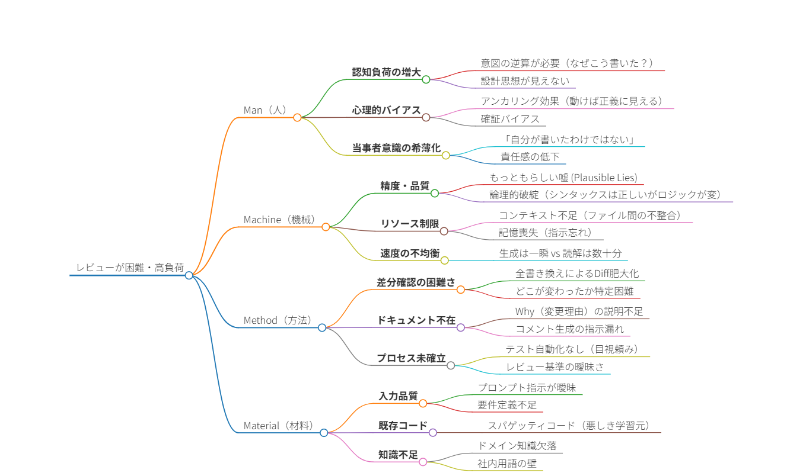

# 課題

- トークン制限
- ハルシネーション
- 人のレビュー困難

## 課題の整理

### トークン長（コンテキストウィンドウ）の制限

ローカル環境のハードウェア制約（主にVRAM）により、プロンプトとして入力できる情報量に物理的な限界があることによる課題。

| ID   | プロセス / 機能      | 故障モード (Failure Mode)               | 影響 (Effect)                                                                        | 原因 (Cause)                                                                            | S    | O    | D    | **RPN** | 推奨される対策・緩和策                                                                                                               |
| :--- | :------------------- | :-------------------------------------- | :----------------------------------------------------------------------------------- | :-------------------------------------------------------------------------------------- | :--- | :--- | :--- | :------ | :----------------------------------------------------------------------------------------------------------------------------------- |
| A-1  | **コード読解・要約** | **コンテキストの断絶・忘却**            | 依存関係にある関数の定義や変数の型を見落とし、既存コードと矛盾した実装を行う。       | VRAM不足によるモデルのコンテキスト長制限超過。入力情報の切り捨て（Truncation）。        | 6    | 8    | 3    | **144** | ・RAG（検索拡張生成）による関連情報の動的抽出 ・スライディングウィンドウ方式の実装 ・Tree-sitter等を用いた重要コードの優先抽出 |
| A-2  | **リファクタリング** | **指示の途中消失 (Lost in the Middle)** | 「変数名はキャメルケース」等のスタイル指示や制約事項が、長文入力の後半で無視される。 | 注意機構（Attention）の精度低下。特にプロンプトの中間部分の情報が重視されなくなる現象。 | 3    | 6    | 2    | **36**  | ・System Promptによる指示の再注入 ・処理単位の細分化（ファイル単位ではなく関数単位で処理）                                        |

---

## ハルシネーション（幻覚）

ローカルモデル（7B〜30B程度）の知識量・推論能力の限界により、事実に基づかない、または論理的に誤ったコードを生成する課題。

| ID   | プロセス / 機能    | 故障モード (Failure Mode)    | 影響 (Effect)                                                                                        | 原因 (Cause)                                                                     | S     | O    | D    | **RPN** | 推奨される対策・緩和策                                                                                                       |
| :--- | :----------------- | :--------------------------- | :--------------------------------------------------------------------------------------------------- | :------------------------------------------------------------------------------- | :---- | :--- | :--- | :------ | :--------------------------------------------------------------------------------------------------------------------------- |
| B-1  | **ライブラリ使用** | **存在しない関数の捏造**     | 実在しないメソッド（例: `date.to_japan_format()`）を提案し、実行時エラーを引き起こす。               | 学習データの不足による確率的な穴埋め。バージョン違いの知識の混同。               | 4     | 7    | 2    | **56**  | ・RAGによる公式ドキュメントの参照強制 ・LSP（Language Server Protocol）連携によるリアルタイム検証                         |
| B-2  | **ロジック実装**   | **脆弱性の混入**             | SQLインジェクション、XSS、ハードコードされた認証情報など、セキュリティリスクのあるコードを生成する。 | 安全性を判断する論理的推論能力の不足。学習データに含まれる低品質なコードの再現。 | **9** | 3    | 8    | **216** | ・セキュリティ特化モデルの使用 ・生成コードに対する静的解析ツール（SAST）の自動適用 ・人間によるコードレビューの義務化 |
| B-3  | **デバッグ支援**   | **誤った原因・修正案の提示** | エラーログに対して無関係な修正案を提示し、デバッグ作業を混乱・遅延させる。                           | エラーメッセージとコードの因果関係推論の失敗。                                   | 5     | 5    | 5    | **125** | ・CoT（Chain of Thought）プロンプトによる段階的推論 ・エラー発生箇所周辺に関連コンテキストを絞り込む                      |

---

## レビューの困難性

