# 勤務管理アプリケーション(FlowApp)開発

## 機能

勤務管理アプリの機能について記載する。

### 機能一覧

1. 在宅勤務管理機能
   1. 在宅勤務申請機能
   2. 在宅勤務記録機能
2. 休暇管理機能
   1. 休暇申請機能
3. 休日出勤管理機能
   1. 休日出勤申請機能
4. 特別条項管理機能
   1. 特別条項申請機能
   2. 特別条項判定機能
5. 定時日残業管理機能
   1. 定時日残業申請機能
6. 管理・システム連携機能

### 在宅勤務管理機能

#### 在宅勤務申請機能

在宅勤務に関する申請を行う機能である。 
以下の機能要件を満足する必要がある。

1. ユーザーは将来の在宅勤務の申請が行える（申請を行うものを申請者とする）
2. 申請者は申請に日付が1日（午前・午後）、複数日指定できる
3. 申請者は申請に理由が入力できる
4. 申請者は申請の承認先が設定できる（承認を行うものを承認者とする）
5. 承認先に設定されたユーザーは申請の承認ができる
6. 承認先に設定されたユーザーは申請の否認ができる
7. 承認先に設定されたユーザーは否認する際、コメントを記載できる
8. 申請者は申請が次承認者に承認されていない場合、取り戻しできる
9. 申請の承認履歴は一定期間保存される
10. 管理者は、申請の承認記録を取得できる（一部のユーザーを管理者とする）
11. 申請者は承認済みの申請を取り下げることができる。
12. 承認者に申請の取り下げが通知できる
13. 申請者は承認済みの申請の日付を変更し、再申請が行える
14. 申請期限制御: 当日や事後の申請に対し、警告表示または理由入力を必須化する
15. 代理承認: 承認者が不在の場合、上位管理者や指定された代理人が承認を行える
16. 代理申請: 本人が操作できない場合、管理者が代理で申請を行える

#### 在宅勤務記録機能

在宅勤務に関する申請を行う機能である。 
以下の機能要件を満足する必要がある。

1. 承認済の在宅勤務日に在宅勤務記録が行える(承認済の在宅勤務を行うユーザーを在宅勤務者とする)
2. 在宅勤務者に在宅勤務記録(開始)の通知が行える
3. 在宅勤務者は在宅勤務記録(開始)に、勤務場所、勤務開始時刻、業務内容が入力できる
4. 在宅勤務者は在宅勤務記録（途中）に、中抜け、特記事項を入力できる
5. 在宅勤務者は在宅勤務記録（終了）に、勤務終了時刻、成果が入力できる
6. 在宅勤務者は在宅勤務記録の変更が行える
7. 在宅勤務記録は一定期間保存される
8. 在宅勤務記録の変更履歴は一定期間保存される
9. 管理者に在宅勤務記録の登録、変更が通知される
10. 入力補助（テンプレート）: 業務内容や理由について、履歴からの引用や定型文選択により入力を補助する
11. 打刻リマインド: 勤務開始時刻や終了予定時刻を過ぎても記録がない場合、プッシュ通知やTeamsで通知する

### 休暇管理機能

#### 休暇申請機能

休暇取得に関する申請を行う機能である。 
以下の機能要件を満足する必要がある。

1. ユーザーは将来の休暇勤務の申請が行える（申請を行うものを申請者とする）
2. 申請者は申請に日付が1日（午前・午後）、複数日指定できる
3. 申請者は申請に理由が入力できる
4. 申請者は申請の承認先が設定できる（承認を行うものを承認者とする）
5. 承認先に設定されたユーザーは申請の承認ができる
6. 承認先に設定されたユーザーは申請の否認ができる
7. 承認先に設定されたユーザーは否認する際、コメントを記載できる
8. 申請者は申請が次承認者に承認されていない場合、取り戻しできる
9. 申請の承認履歴は一定期間保存される
10. 管理者は、申請の承認記録を取得できる（一部のユーザーを管理者とする）
11. 申請者は承認済みの申請を取り下げることができる。
12. 承認者に申請の取り下げが通知できる
13. 申請者は承認済みの申請の日付を変更し、再申請が行える
14. 申請期限制御: 当日や事後の申請に対し、警告表示または理由入力を必須化する
15. 代理承認: 承認者が不在の場合、上位管理者や指定された代理人が承認を行える
16. 代理申請: 本人が操作できない場合、管理者が代理で申請を行える

### 休日出勤管理機能

#### 休日出勤申請機能

休日出勤に関する申請を行う機能である。 
以下の機能要件を満足する必要がある。

1. ユーザーは将来の休日出勤の申請が行える（申請を行うものを申請者とする）
2. 申請者は申請に日付が1日（午前・午後）、複数日指定できる
3. 申請者は申請に理由が入力できる
4. 申請者は申請の承認先が設定できる（承認を行うものを承認者とする）
5. 承認先に設定されたユーザーは申請の承認ができる
6. 承認先に設定されたユーザーは申請の否認ができる
7. 承認先に設定されたユーザーは否認する際、コメントを記載できる
8. 申請者は申請が次承認者に承認されていない場合、取り戻しできる
9. 申請の承認履歴は一定期間保存される
10. 管理者は、申請の承認記録を取得できる（一部のユーザーを管理者とする）
11. 申請者は承認済みの申請を取り下げることができる。
12. 承認者に申請の取り下げが通知できる
13. 申請者は承認済みの申請の日付を変更し、再申請が行える
14. 申請期限制御: 当日や事後の申請に対し、警告表示または理由入力を必須化する

### 特別条項管理機能

#### 特別条項申請機能

特別条項に関する申請を行う機能である。 
以下の機能要件を満足する必要がある。

1. ユーザーは当月の特別条項の申請が行える（申請を行うものを申請者とする）
2. 申請者は月間特別条項が申請できる
3. 申請者は年間特別条項が申請できる。ただし、当該年度の年間特別条項を提出済みの申請者は、再び申請することはできない。
4. 申請者は申請に理由が入力できる（必須）
5. 申請者は申請の承認先が設定できる（承認を行うものを承認者とする）
6. 承認先に設定されたユーザーは申請の承認ができる
7. 承認先に設定されたユーザーは申請の否認ができる
8. 承認先に設定されたユーザーは否認する際、コメントを記載できる
9. 申請者は申請が次承認者に承認されていない場合、取り戻しできる
10. 申請の承認履歴は一定期間保存される
11. 管理者は、申請の承認記録を取得できる（一部のユーザーを管理者とする）
12. 申請者は承認済みの申請を取り下げることができる。
13. 承認者に申請の取り下げが通知できる

#### 特別条項判定機能

特別条項を行うユーザーに、連続での月間申請に対する警告を与える機能である。

1. ユーザーの過去の承認済み月間特別条項申請の記録を取得できる
2. 3か月連続で月間特別条項を申請した場合、申請時にユーザーに警告を与える
3. 3か月連続で月間特別条項を申請した場合、承認時に管理者に警告を与える

### 定時日残業管理機能

#### 定時日残業申請機能

1. ユーザーは当日の定時日残業の申請が行える（申請を行うものを申請者とする）
2. 申請者は申請の承認先が設定できる（承認を行うものを承認者とする）
3. 承認先に設定されたユーザーは申請の承認ができる
4. 承認先に設定されたユーザーは申請の否認ができる
5. 承認先に設定されたユーザーは否認する際、コメントを記載できる
6. 申請者は申請が次承認者に承認されていない場合、取り戻しできる
7. 申請の承認履歴は一定期間保存される
8. 管理者は、申請の承認記録を取得できる（一部のユーザーを管理者とする）
9. 申請者は承認済みの申請を取り下げることができる。
10. 承認者に申請の取り下げが通知できる

### 管理・システム連携機能

1. カレンダー表示: チームメンバーや管理者が、誰がいつ勤務予定をカレンダー形式で一覧確認できる
2. データ出力が行える（外部システムとの連携に際し、どのような形式で出力できる必要があるか検討）
3. 帳票出力: （どういう形式の帳票出力が必要か検討）

## 業務フロー設計

### 共通機能

#### 承認履歴の確認

- カレンダー表示機能を包含する

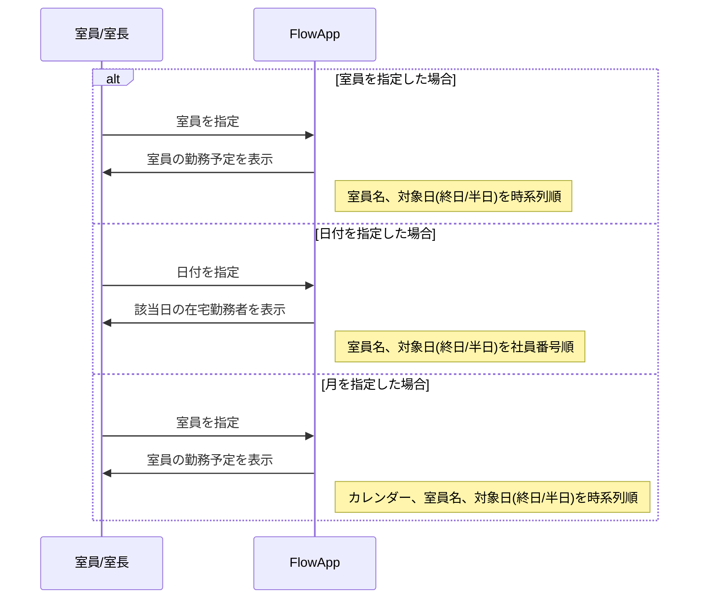
```mermaid
sequenceDiagram
    participant Staff as 室員/室長
    participant apps as FlowApp

    alt 室員を指定した場合
        Staff->>apps: 室員を指定
        apps->>Staff: 室員の勤務予定を表示
        Note right of apps: 室員名、対象日(終日/半日)を時系列順
    else 日付を指定した場合
        Staff->>apps: 日付を指定
        apps->>Staff: 該当日の在宅勤務者を表示
        Note right of apps: 室員名、対象日(終日/半日)を社員番号順
    else 月を指定した場合
        Staff->>apps: 室員を指定
        apps->>Staff: 室員の勤務予定を表示
        Note right of apps: カレンダー、室員名、対象日(終日/半日)を時系列順
    end
```

#### 在宅/出張報告

- 在宅勤務者には定時に(開始/終了)通知
- 定時より前に入力する場合は自身で入力
- 出張者は自身で入力

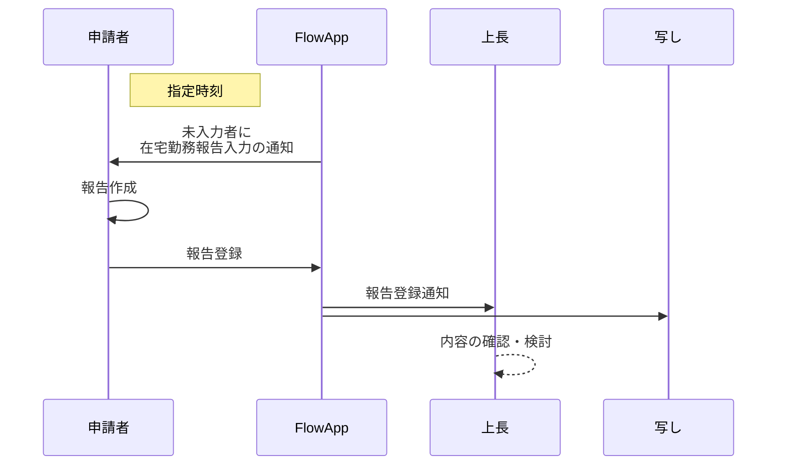
```mermaid
sequenceDiagram
    participant Staff as 申請者
    participant apps as FlowApp
    participant Boss as 上長
    participant Colleague as 写し

    Note right of Staff: 指定時刻
    apps->>Staff: 未入力者に<br>在宅勤務報告入力の通知
    Staff->>Staff: 報告作成
    Staff->>apps:報告登録
    apps->>Boss:報告登録通知
    apps->>Colleague:
    Boss-->>Boss: 内容の確認・検討
```

#### 申請の取り戻し

- 申請者が、次承認者にまだ承認されていない申請を取り戻す
- 取り戻した申請は「下書き」状態に戻る

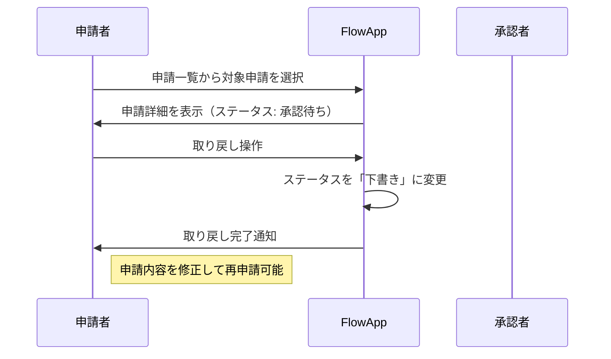
```mermaid
sequenceDiagram
    participant Staff as 申請者
    participant apps as FlowApp
    participant Boss as 承認者

    Staff->>apps: 申請一覧から対象申請を選択
    apps->>Staff: 申請詳細を表示（ステータス: 承認待ち）
    Staff->>apps: 取り戻し操作
    apps->>apps: ステータスを「下書き」に変更
    apps->>Staff: 取り戻し完了通知
    Note right of Staff: 申請内容を修正して再申請可能
```

#### 承認済み申請の取り下げ

- 申請者が承認済みの申請を取り下げる
- 承認者に取り下げが通知される

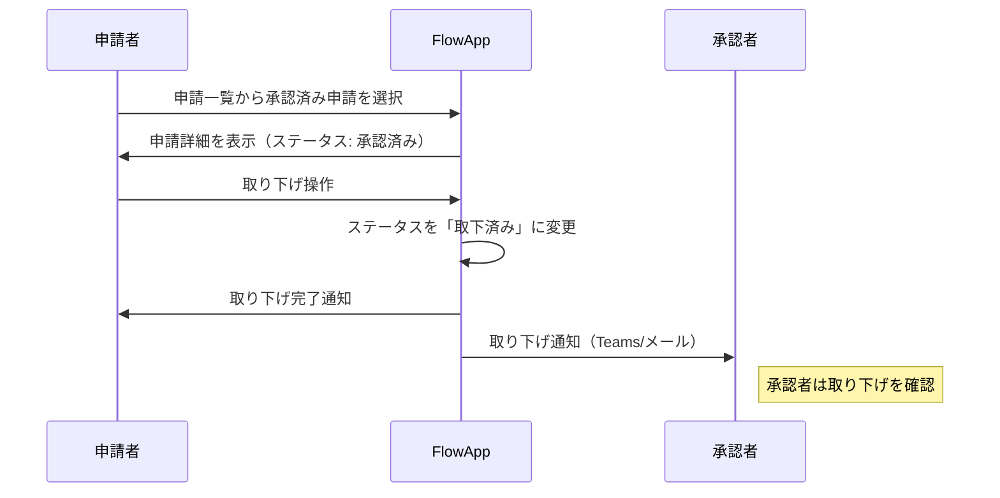
```mermaid
sequenceDiagram
    participant Staff as 申請者
    participant apps as FlowApp
    participant Boss as 承認者

    Staff->>apps: 申請一覧から承認済み申請を選択
    apps->>Staff: 申請詳細を表示（ステータス: 承認済み）
    Staff->>apps: 取り下げ操作
    apps->>apps: ステータスを「取下済み」に変更
    apps->>Staff: 取り下げ完了通知
    apps->>Boss: 取り下げ通知（Teams/メール）
    Note right of Boss: 承認者は取り下げを確認
```

#### 日付変更・再申請

- 承認済みの申請の日付を変更し、再度承認を受ける

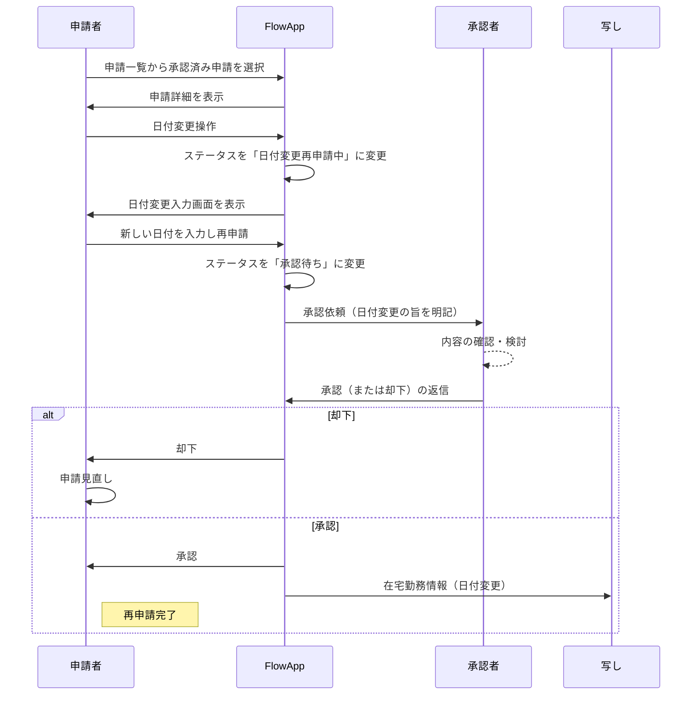
```mermaid
sequenceDiagram
    participant Staff as 申請者
    participant apps as FlowApp
    participant Boss as 承認者
    participant Colleague as 写し

    Staff->>apps: 申請一覧から承認済み申請を選択
    apps->>Staff: 申請詳細を表示
    Staff->>apps: 日付変更操作
    apps->>apps: ステータスを「日付変更再申請中」に変更
    apps->>Staff: 日付変更入力画面を表示
    Staff->>apps: 新しい日付を入力し再申請
    apps->>apps: ステータスを「承認待ち」に変更
    apps->>Boss: 承認依頼（日付変更の旨を明記）
    Boss-->>Boss: 内容の確認・検討
    Boss->>apps: 承認（または却下）の返信
    alt 却下
        apps->>Staff: 却下
        Staff->>Staff: 申請見直し
    else 承認
        apps->>Staff: 承認
        apps->>Colleague: 在宅勤務情報（日付変更）
        Note right of Staff: 再申請完了
    end
```

#### 代理申請

- 管理者が本人に代わって申請を行う
- 代理申請者の情報が記録される

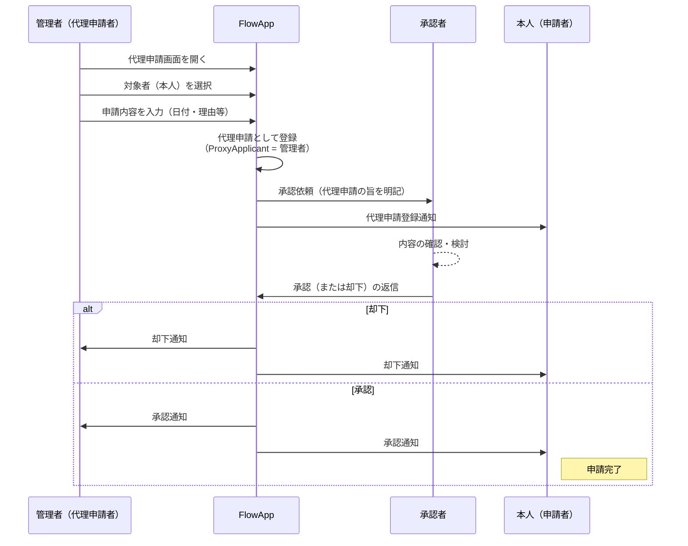
```mermaid
sequenceDiagram
    participant Admin as 管理者（代理申請者）
    participant apps as FlowApp
    participant Boss as 承認者
    participant Staff as 本人（申請者）

    Admin->>apps: 代理申請画面を開く
    Admin->>apps: 対象者（本人）を選択
    Admin->>apps: 申請内容を入力（日付・理由等）
    apps->>apps: 代理申請として登録<br>（ProxyApplicant = 管理者）
    apps->>Boss: 承認依頼（代理申請の旨を明記）
    apps->>Staff: 代理申請登録通知
    Boss-->>Boss: 内容の確認・検討
    Boss->>apps: 承認（または却下）の返信
    alt 却下
        apps->>Admin: 却下通知
        apps->>Staff: 却下通知
    else 承認
        apps->>Admin: 承認通知
        apps->>Staff: 承認通知
        Note right of Staff: 申請完了
    end
```

#### 代理承認

- 承認者が不在の場合、代理設定に基づき代理人が承認を行う

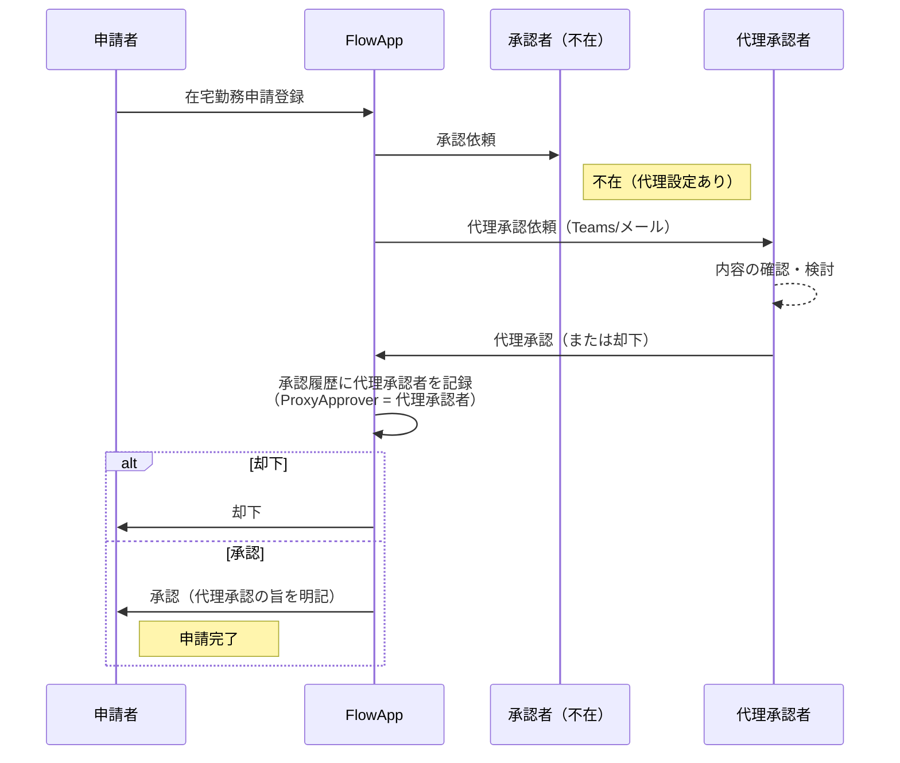
```mermaid
sequenceDiagram
    participant Staff as 申請者
    participant apps as FlowApp
    participant Boss as 承認者（不在）
    participant Proxy as 代理承認者

    Staff->>apps: 在宅勤務申請登録
    apps->>Boss: 承認依頼
    Note right of Boss: 不在（代理設定あり）
    apps->>Proxy: 代理承認依頼（Teams/メール）
    Proxy-->>Proxy: 内容の確認・検討
    Proxy->>apps: 代理承認（または却下）
    apps->>apps: 承認履歴に代理承認者を記録<br>（ProxyApprover = 代理承認者）
    alt 却下
        apps->>Staff: 却下
    else 承認
        apps->>Staff: 承認（代理承認の旨を明記）
        Note right of Staff: 申請完了
    end
```

### 在宅勤務管理

#### 在宅勤務申請承認

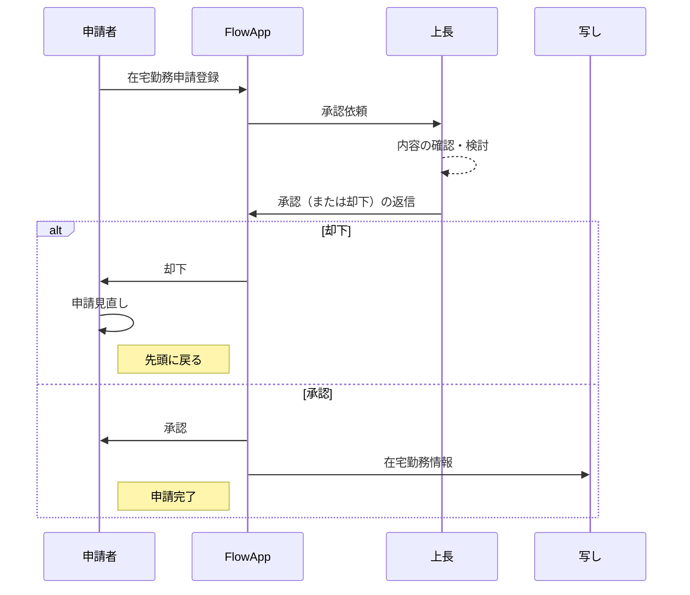
```mermaid
sequenceDiagram
    participant Staff as 申請者
    participant apps as FlowApp
    participant Boss as 上長
    participant Colleague as 写し

    Staff->>apps: 在宅勤務申請登録
    apps->>Boss: 承認依頼
    Boss-->>Boss: 内容の確認・検討
    Boss->>apps: 承認（または却下）の返信
    alt 却下
        apps->>Staff: 却下
        Staff->>Staff:申請見直し
        Note right of Staff: 先頭に戻る
    else 承認
        apps->>Staff: 承認
        apps->>Colleague: 在宅勤務情報
        Note right of Staff: 申請完了
    end
```

### 休暇管理

#### 休暇申請承認

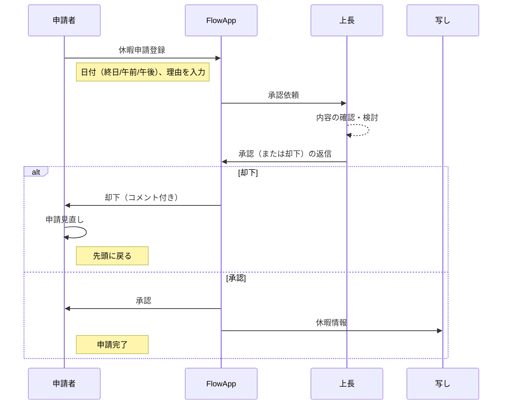
```mermaid
sequenceDiagram
    participant Staff as 申請者
    participant apps as FlowApp
    participant Boss as 上長
    participant Colleague as 写し

    Staff->>apps: 休暇申請登録
    Note right of Staff: 日付（終日/午前/午後）、理由を入力
    apps->>Boss: 承認依頼
    Boss-->>Boss: 内容の確認・検討
    Boss->>apps: 承認（または却下）の返信
    alt 却下
        apps->>Staff: 却下（コメント付き）
        Staff->>Staff: 申請見直し
        Note right of Staff: 先頭に戻る
    else 承認
        apps->>Staff: 承認
        apps->>Colleague: 休暇情報
        Note right of Staff: 申請完了
    end
```

### 休日出勤管理

#### 休日出勤申請承認

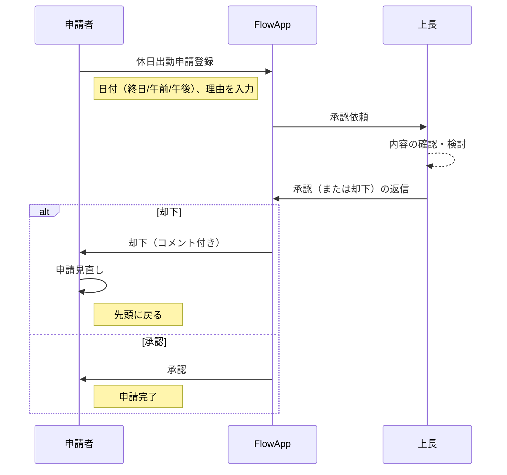
```mermaid
sequenceDiagram
    participant Staff as 申請者
    participant apps as FlowApp
    participant Boss as 上長

    Staff->>apps: 休日出勤申請登録
    Note right of Staff: 日付（終日/午前/午後）、理由を入力
    apps->>Boss: 承認依頼
    Boss-->>Boss: 内容の確認・検討
    Boss->>apps: 承認（または却下）の返信
    alt 却下
        apps->>Staff: 却下（コメント付き）
        Staff->>Staff: 申請見直し
        Note right of Staff: 先頭に戻る
    else 承認
        apps->>Staff: 承認
        Note right of Staff: 申請完了
    end
```

### 特別条項管理

#### 特別条項申請承認

- 月間特別条項・年間特別条項の申請
- 年間特別条項は当該年度に1回のみ申請可能

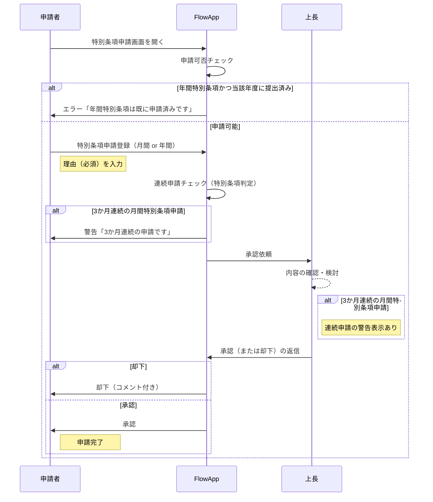
```mermaid
sequenceDiagram
    participant Staff as 申請者
    participant apps as FlowApp
    participant Boss as 上長

    Staff->>apps: 特別条項申請画面を開く
    apps->>apps: 申請可否チェック
    alt 年間特別条項かつ当該年度に提出済み
        apps->>Staff: エラー「年間特別条項は既に申請済みです」
    else 申請可能
        Staff->>apps: 特別条項申請登録（月間 or 年間）
        Note right of Staff: 理由（必須）を入力
        apps->>apps: 連続申請チェック（特別条項判定）
        alt 3か月連続の月間特別条項申請
            apps->>Staff: 警告「3か月連続の申請です」
        end
        apps->>Boss: 承認依頼
        Boss-->>Boss: 内容の確認・検討
        alt 3か月連続の月間特別条項申請
            Note right of Boss: 連続申請の警告表示あり
        end
        Boss->>apps: 承認（または却下）の返信
        alt 却下
            apps->>Staff: 却下（コメント付き）
        else 承認
            apps->>Staff: 承認
            Note right of Staff: 申請完了
        end
    end
```

### 定時日残業管理

#### 定時日残業申請承認

- 当日の定時日残業に対する申請

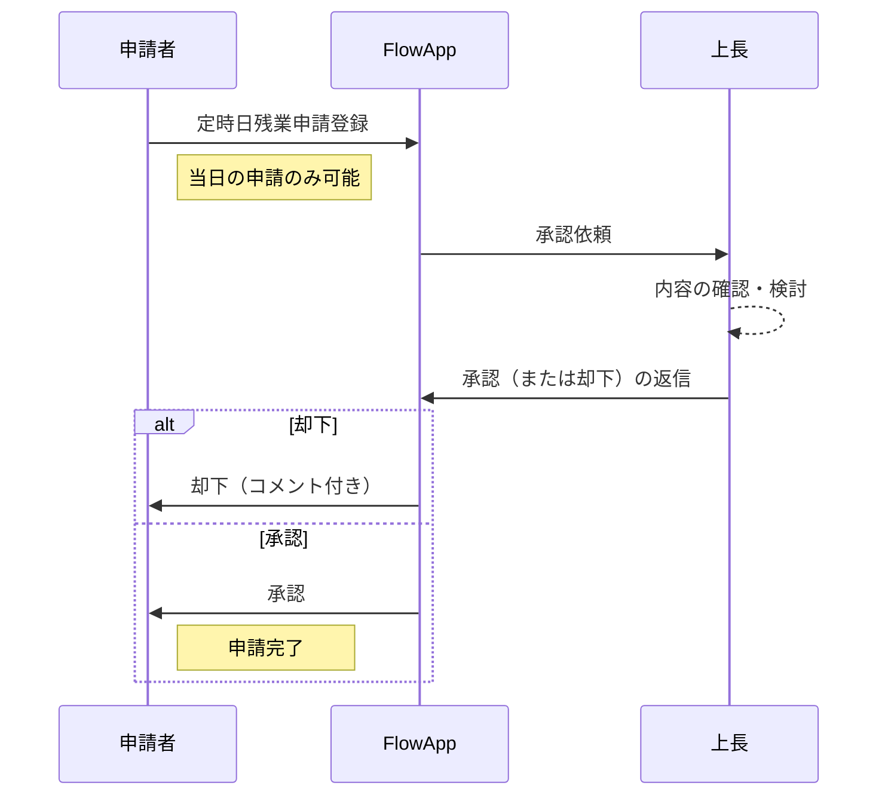
```mermaid
sequenceDiagram
    participant Staff as 申請者
    participant apps as FlowApp
    participant Boss as 上長

    Staff->>apps: 定時日残業申請登録
    Note right of Staff: 当日の申請のみ可能
    apps->>Boss: 承認依頼
    Boss-->>Boss: 内容の確認・検討
    Boss->>apps: 承認（または却下）の返信
    alt 却下
        apps->>Staff: 却下（コメント付き）
    else 承認
        apps->>Staff: 承認
        Note right of Staff: 申請完了
    end
```

### データ出力

- 管理者が各種帳票・連携データを出力する

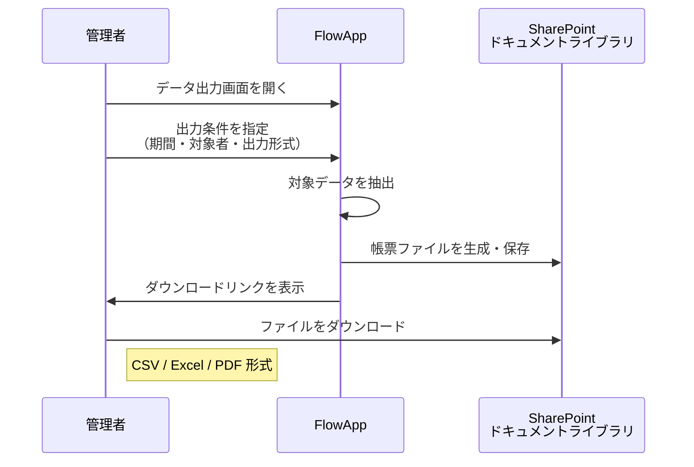
```mermaid
sequenceDiagram
    participant Admin as 管理者
    participant apps as FlowApp
    participant SP as SharePoint<br>ドキュメントライブラリ

    Admin->>apps: データ出力画面を開く
    Admin->>apps: 出力条件を指定<br>（期間・対象者・出力形式）
    apps->>apps: 対象データを抽出
    apps->>SP: 帳票ファイルを生成・保存
    apps->>Admin: ダウンロードリンクを表示
    Admin->>SP: ファイルをダウンロード
    Note right of Admin: CSV / Excel / PDF 形式
```

### 代理設定

- 承認者または管理者が代理承認/代理申請の設定を行う

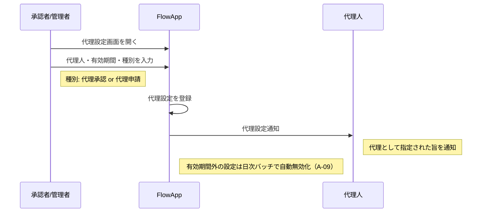
```mermaid
sequenceDiagram
    participant Boss as 承認者/管理者
    participant apps as FlowApp
    participant Proxy as 代理人

    Boss->>apps: 代理設定画面を開く
    Boss->>apps: 代理人・有効期間・種別を入力
    Note right of Boss: 種別: 代理承認 or 代理申請
    apps->>apps: 代理設定を登録
    apps->>Proxy: 代理設定通知
    Note right of Proxy: 代理として指定された旨を通知
    Note right of apps: 有効期間外の設定は日次バッチで自動無効化（A-09）
```

#### 不在設定の有効化・解除

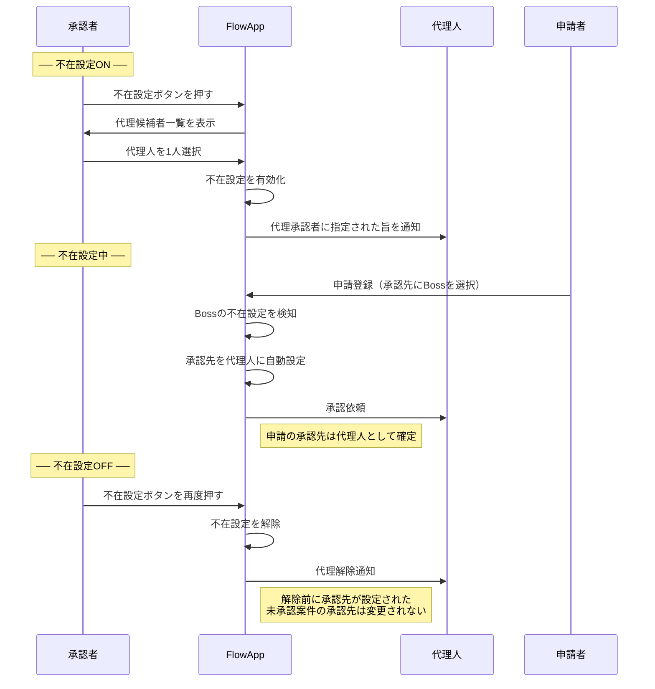
```mermaid
sequenceDiagram
    participant Boss as 承認者
    participant apps as FlowApp
    participant Proxy as 代理人
    participant Staff as 申請者

    Note over Boss: ── 不在設定ON ──
    Boss->>apps: 不在設定ボタンを押す
    apps->>Boss: 代理候補者一覧を表示
    Boss->>apps: 代理人を1人選択
    apps->>apps: 不在設定を有効化
    apps->>Proxy: 代理承認者に指定された旨を通知

    Note over Boss: ── 不在設定中 ──
    Staff->>apps: 申請登録（承認先にBossを選択）
    apps->>apps: Bossの不在設定を検知
    apps->>apps: 承認先を代理人に自動設定
    apps->>Proxy: 承認依頼
    Note right of apps: 申請の承認先は代理人として確定

    Note over Boss: ── 不在設定OFF ──
    Boss->>apps: 不在設定ボタンを再度押す
    apps->>apps: 不在設定を解除
    apps->>Proxy: 代理解除通知
    Note right of apps: 解除前に承認先が設定された<br>未承認案件の承認先は変更されない
```

## データモデル設計

### ER図（実体関連図）

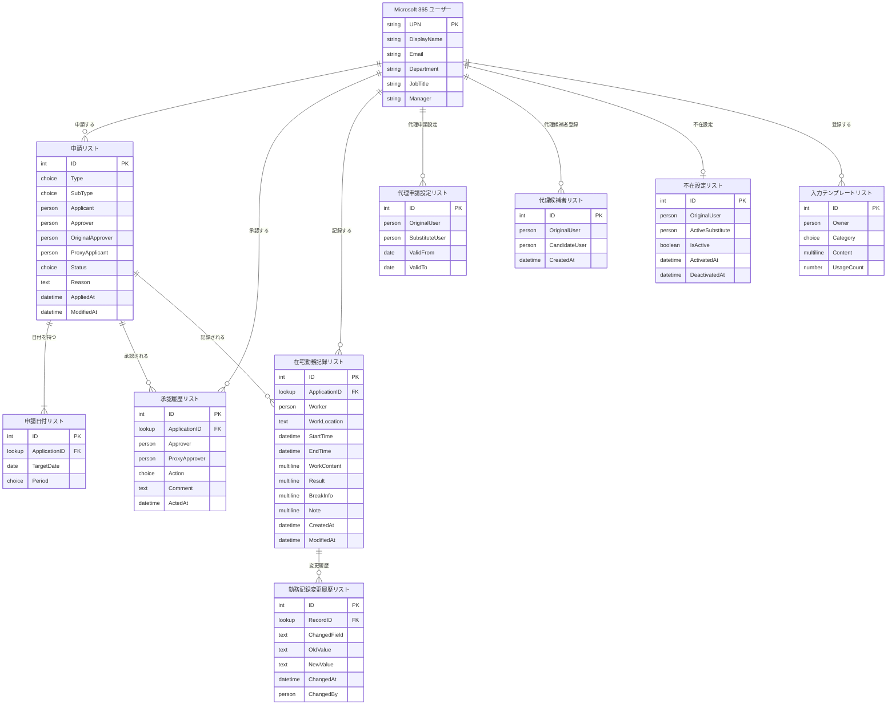
```mermaid
erDiagram
    M365_USER["Microsoft 365 ユーザー"] {
        string UPN PK
        string DisplayName
        string Email
        string Department
        string JobTitle
        string Manager
    }
    APPLICATION["申請リスト"] {
        int ID PK
        choice Type
        choice SubType
        person Applicant
        person Approver
        person OriginalApprover
        person ProxyApplicant
        choice Status
        text Reason
        datetime AppliedAt
        datetime ModifiedAt
    }
    APPLICATION_DATE["申請日付リスト"] {
        int ID PK
        lookup ApplicationID FK
        date TargetDate
        choice Period
    }
    APPROVAL["承認履歴リスト"] {
        int ID PK
        lookup ApplicationID FK
        person Approver
        person ProxyApprover
        choice Action
        text Comment
        datetime ActedAt
    }
    WORK_RECORD["在宅勤務記録リスト"] {
        int ID PK
        lookup ApplicationID FK
        person Worker
        text WorkLocation
        datetime StartTime
        datetime EndTime
        multiline WorkContent
        multiline Result
        multiline BreakInfo
        multiline Note
        datetime CreatedAt
        datetime ModifiedAt
    }
    WORK_RECORD_HISTORY["勤務記録変更履歴リスト"] {
        int ID PK
        lookup RecordID FK
        text ChangedField
        text OldValue
        text NewValue
        datetime ChangedAt
        person ChangedBy
    }
    SUBSTITUTE_SETTING["代理申請設定リスト"] {
        int ID PK
        person OriginalUser
        person SubstituteUser
        date ValidFrom
        date ValidTo
    }
    SUBSTITUTE_CANDIDATE["代理候補者リスト"] {
        int ID PK
        person OriginalUser
        person CandidateUser
        datetime CreatedAt
    }
    ABSENCE_SETTING["不在設定リスト"] {
        int ID PK
        person OriginalUser
        person ActiveSubstitute
        boolean IsActive
        datetime ActivatedAt
        datetime DeactivatedAt
    }
    TEMPLATE["入力テンプレートリスト"] {
        int ID PK
        person Owner
        choice Category
        multiline Content
        number UsageCount
    }

    M365_USER ||--o{ APPLICATION : "申請する"
    M365_USER ||--o{ APPROVAL : "承認する"
    M365_USER ||--o{ WORK_RECORD : "記録する"
    M365_USER ||--o{ SUBSTITUTE_SETTING : "代理申請設定"
    M365_USER ||--o{ SUBSTITUTE_CANDIDATE : "代理候補者登録"
    M365_USER ||--o| ABSENCE_SETTING : "不在設定"
    M365_USER ||--o{ TEMPLATE : "登録する"
    APPLICATION ||--|{ APPLICATION_DATE : "日付を持つ"
    APPLICATION ||--o{ APPROVAL : "承認される"
    APPLICATION ||--o{ WORK_RECORD : "記録される"
    WORK_RECORD ||--o{ WORK_RECORD_HISTORY : "変更履歴"
```

### テーブル定義書（SharePointリスト / Dataverse テーブル）

**申請リスト（APPLICATION）**

| 列名             | 型                             | 必須  | 説明                                                                  |
| ---------------- | ------------------------------ | :---: | --------------------------------------------------------------------- |
| ID               | 自動採番                       |   ○   | リストID（PK・自動生成）                                              |
| Title            | 1行テキスト                    |   ○   | 申請タイトル（自動生成: 「{種別}_{氏名}_{日付}」）                    |
| Type             | 選択肢                         |   ○   | 申請種別（在宅勤務/休暇/休日出勤/特別条項/定時日残業）                |
| SubType          | 選択肢                         |   -   | サブタイプ（特別条項時: 月間/年間）                                   |
| Applicant        | ユーザーまたはグループ         |   ○   | 申請者（Person型）                                                    |
| Approver         | ユーザーまたはグループ         |   ○   | 承認者（Person型・不在設定時は代理人）                                |
| OriginalApprover | ユーザーまたはグループ         |   -   | 元の承認者（Person型・不在設定で代理人に切替時のみ）                  |
| ProxyApplicant   | ユーザーまたはグループ         |   -   | 代理申請者（Person型）                                                |
| CcUsers          | ユーザーまたはグループ（複数） |   -   | 写し先（Person型・複数選択可）                                        |
| Reason           | 複数行テキスト                 |   ○   | 申請理由（事後申請時・特別条項時は必須）                              |
| Status           | 選択肢                         |   ○   | ステータス（下書き/承認待ち/承認済み/却下/取下済み/日付変更再申請中） |
| AppliedAt        | 日付と時刻                     |   ○   | 申請日時                                                              |
| Created          | 日付と時刻                     |   ○   | 作成日時（自動）                                                      |
| Modified         | 日付と時刻                     |   ○   | 更新日時（自動）                                                      |

**申請日付リスト（APPLICATION_DATE）**

| 列名          | 型          | 必須  | 説明                                    |
| ------------- | ----------- | :---: | --------------------------------------- |
| ID            | 自動採番    |   ○   | リストID（PK・自動生成）                |
| Title         | 1行テキスト |   ○   | タイトル（自動生成: 「{日付}_{区分}」） |
| ApplicationID | 参照        |   ○   | 申請ID（Lookup: APPLICATION）           |
| TargetDate    | 日付のみ    |   ○   | 在宅勤務日                              |
| Period        | 選択肢      |   ○   | 区分（終日/午前/午後）                  |

**承認履歴リスト（APPROVAL）**

| 列名          | 型                     | 必須  | 説明                          |
| ------------- | ---------------------- | :---: | ----------------------------- |
| ID            | 自動採番               |   ○   | リストID（PK・自動生成）      |
| Title         | 1行テキスト            |   ○   | タイトル（自動生成）          |
| ApplicationID | 参照                   |   ○   | 申請ID（Lookup: APPLICATION） |
| Approver      | ユーザーまたはグループ |   ○   | 承認者（Person型）            |
| ProxyApprover | ユーザーまたはグループ |   -   | 代理承認者（Person型）        |
| Action        | 選択肢                 |   ○   | アクション（承認/否認）       |
| Comment       | 複数行テキスト         |   -   | コメント（否認時は必須）      |
| ActedAt       | 日付と時刻             |   ○   | 承認日時                      |

**在宅勤務記録リスト（WORK_RECORD）**

| 列名          | 型                     | 必須  | 説明                                     |
| ------------- | ---------------------- | :---: | ---------------------------------------- |
| ID            | 自動採番               |   ○   | リストID（PK・自動生成）                 |
| Title         | 1行テキスト            |   ○   | タイトル（自動生成）                     |
| ApplicationID | 参照                   |   ○   | 申請ID（Lookup: APPLICATION）            |
| Worker        | ユーザーまたはグループ |   ○   | 在宅勤務者（Person型）                   |
| WorkLocation  | 1行テキスト            |   ○   | 勤務場所                                 |
| StartTime     | 日付と時刻             |   ○   | 勤務開始時刻                             |
| EndTime       | 日付と時刻             |   -   | 勤務終了時刻                             |
| WorkContent   | 複数行テキスト         |   ○   | 業務内容                                 |
| Result        | 複数行テキスト         |   -   | 成果                                     |
| BreakInfo     | 複数行テキスト         |   -   | 中抜け情報                               |
| Note          | 複数行テキスト         |   -   | 特記事項                                 |
| RecordStatus  | 選択肢                 |   ○   | 記録ステータス（未入力/勤務中/勤務完了） |
| Created       | 日付と時刻             |   ○   | 作成日時（自動）                         |
| Modified      | 日付と時刻             |   ○   | 更新日時（自動）                         |

**勤務記録変更履歴リスト（WORK_RECORD_HISTORY）**

| 列名         | 型                     | 必須  | 説明                          |
| ------------ | ---------------------- | :---: | ----------------------------- |
| ID           | 自動採番               |   ○   | リストID（PK・自動生成）      |
| Title        | 1行テキスト            |   ○   | タイトル（自動生成）          |
| RecordID     | 参照                   |   ○   | 記録ID（Lookup: WORK_RECORD） |
| ChangedField | 1行テキスト            |   ○   | 変更項目                      |
| OldValue     | 複数行テキスト         |   -   | 変更前の値                    |
| NewValue     | 複数行テキスト         |   -   | 変更後の値                    |
| ChangedAt    | 日付と時刻             |   ○   | 変更日時                      |
| ChangedBy    | ユーザーまたはグループ |   ○   | 変更者（Person型）            |

**代理申請設定リスト（SUBSTITUTE_SETTING）**

| 列名           | 型                     | 必須  | 説明                     |
| -------------- | ---------------------- | :---: | ------------------------ |
| ID             | 自動採番               |   ○   | リストID（PK・自動生成） |
| Title          | 1行テキスト            |   ○   | タイトル（自動生成）     |
| OriginalUser   | ユーザーまたはグループ |   ○   | 本人（Person型）         |
| SubstituteUser | ユーザーまたはグループ |   ○   | 代理申請者（Person型）   |
| ValidFrom      | 日付のみ               |   ○   | 有効開始日               |
| ValidTo        | 日付のみ               |   ○   | 有効終了日               |

**代理候補者リスト（SUBSTITUTE_CANDIDATE）**

| 列名          | 型                     | 必須  | 説明                                 |
| ------------- | ---------------------- | :---: | ------------------------------------ |
| ID            | 自動採番               |   ○   | リストID（PK・自動生成）             |
| Title         | 1行テキスト            |   ○   | タイトル（自動生成）                 |
| OriginalUser  | ユーザーまたはグループ |   ○   | 承認者本人（Person型）               |
| CandidateUser | ユーザーまたはグループ |   ○   | 代理候補者（Person型・複数件登録可） |
| Created       | 日付と時刻             |   ○   | 登録日時（自動）                     |

**不在設定リスト（ABSENCE_SETTING）**

| 列名             | 型                     | 必須  | 説明                                   |
| ---------------- | ---------------------- | :---: | -------------------------------------- |
| ID               | 自動採番               |   ○   | リストID（PK・自動生成）               |
| Title            | 1行テキスト            |   ○   | タイトル（自動生成）                   |
| OriginalUser     | ユーザーまたはグループ |   ○   | 承認者本人（Person型）                 |
| ActiveSubstitute | ユーザーまたはグループ |   -   | 現在の代理承認者（Person型・ON時のみ） |
| IsActive         | はい/いいえ            |   ○   | 不在設定のON/OFF（デフォルト: いいえ） |
| ActivatedAt      | 日付と時刻             |   -   | 不在設定有効化日時                     |
| DeactivatedAt    | 日付と時刻             |   -   | 不在設定解除日時                       |

**入力テンプレートリスト（TEMPLATE）**

| 列名       | 型                     | 必須  | 説明                               |
| ---------- | ---------------------- | :---: | ---------------------------------- |
| ID         | 自動採番               |   ○   | リストID（PK・自動生成）           |
| Title      | 1行テキスト            |   ○   | テンプレート名                     |
| Owner      | ユーザーまたはグループ |   ○   | 所有者（Person型）                 |
| Category   | 選択肢                 |   ○   | カテゴリ（業務内容/申請理由/成果） |
| Content    | 複数行テキスト         |   ○   | テンプレート内容                   |
| UsageCount | 数値                   |   ○   | 使用回数（デフォルト: 0）          |

#### ステータス遷移図（状態遷移図）

**申請ステータス遷移**

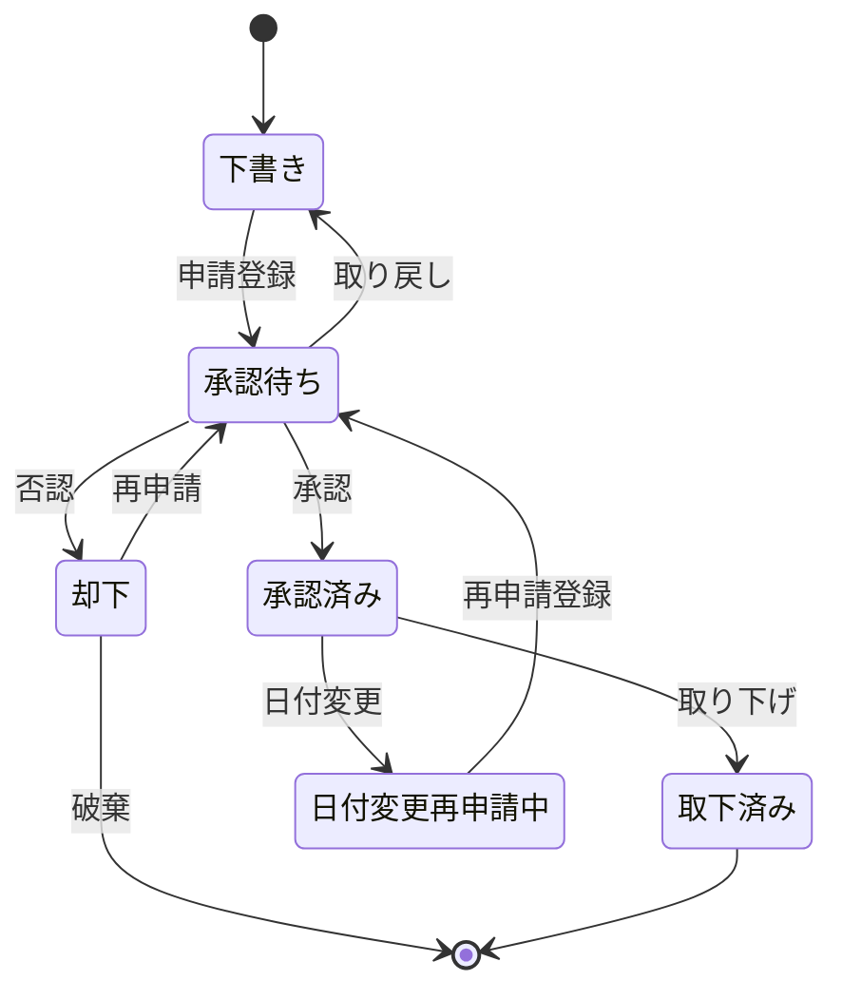
```mermaid
stateDiagram-v2
    [*] --> 下書き
    下書き --> 承認待ち: 申請登録
    承認待ち --> 承認済み: 承認
    承認待ち --> 却下: 否認
    承認待ち --> 下書き: 取り戻し
    却下 --> 承認待ち: 再申請
    却下 --> [*]: 破棄
    承認済み --> 取下済み: 取り下げ
    承認済み --> 日付変更再申請中: 日付変更
    日付変更再申請中 --> 承認待ち: 再申請登録
    取下済み --> [*]
```

**在宅勤務記録ステータス遷移**

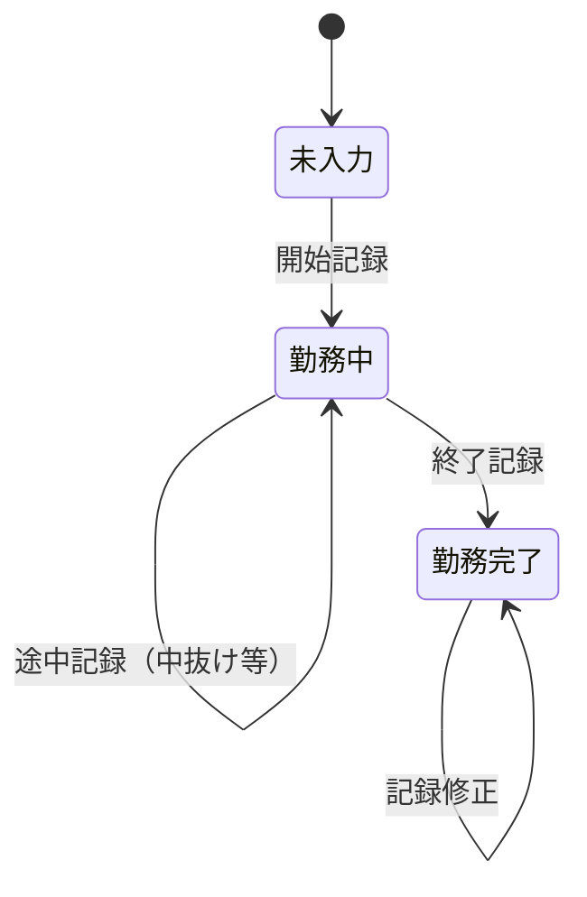
```mermaid
stateDiagram-v2
    [*] --> 未入力
    未入力 --> 勤務中: 開始記録
    勤務中 --> 勤務中: 途中記録（中抜け等）
    勤務中 --> 勤務完了: 終了記録
    勤務完了 --> 勤務完了: 記録修正
```

## 画面設計 (UI/UX)

### 画面一覧（サイトマップ）

| No  | 画面ID          | 画面名                   | 概要                                                       | 利用者        |
| --- | --------------- | ------------------------ | ---------------------------------------------------------- | ------------- |
| 1   | SCR-TOP         | トップ（ダッシュボード） | 通知一覧、直近の申請・記録状況、不在設定ボタン             | 全ユーザー    |
| 2   | SCR-APP-LIST    | 申請一覧                 | 全種別（在宅/休暇/休日出勤/特別条項/定時日残業）の申請一覧 | 申請者        |
| 3   | SCR-APP-NEW     | 申請新規登録             | 各種申請の新規入力（種別選択式）                           | 申請者        |
| 4   | SCR-APP-DETAIL  | 申請詳細                 | 申請内容・承認状況の確認                                   | 申請者/承認者 |
| 5   | SCR-APP-EDIT    | 申請編集                 | 日付変更・再申請入力                                       | 申請者        |
| 6   | SCR-APR-LIST    | 承認待ち一覧             | 自分宛の承認待ち申請一覧（代理承認分含む）                 | 承認者        |
| 7   | SCR-APR-ACTION  | 承認・否認               | 申請の承認/否認操作                                        | 承認者        |
| 8   | SCR-APR-HISTORY | 承認履歴                 | 過去の承認履歴検索・閲覧                                   | 承認者/管理者 |
| 9   | SCR-REC-LIST    | 勤務記録一覧             | 自分の在宅勤務記録一覧                                     | 在宅勤務者    |
| 10  | SCR-REC-START   | 勤務記録（開始）         | 勤務場所・開始時刻・業務内容の入力                         | 在宅勤務者    |
| 11  | SCR-REC-MID     | 勤務記録（途中）         | 中抜け・特記事項の入力                                     | 在宅勤務者    |
| 12  | SCR-REC-END     | 勤務記録（終了）         | 終了時刻・成果の入力                                       | 在宅勤務者    |
| 13  | SCR-REC-EDIT    | 勤務記録編集             | 登録済み記録の修正                                         | 在宅勤務者    |
| 14  | SCR-CAL         | カレンダー               | チーム勤務予定カレンダー表示                               | 全ユーザー    |
| 15  | SCR-ADM-SEARCH  | 管理者検索               | 室員別/日付別/月別の承認記録検索                           | 管理者        |
| 16  | SCR-ADM-EXPORT  | データ出力               | CSV/PDF/Excel出力                                          | 管理者        |
| 17  | SCR-ADM-SUBST   | 代理設定                 | 代理申請の設定・代理候補者の登録                           | 承認者/管理者 |
| 18  | SCR-TMPL        | テンプレート管理         | 入力テンプレートの登録・編集                               | 全ユーザー    |

### 画面遷移図

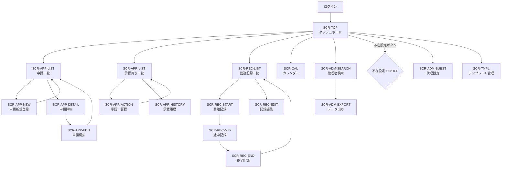
```mermaid
graph TD
    LOGIN[ログイン] --> TOP[SCR-TOP<br>ダッシュボード]
    
    TOP --> APP_LIST[SCR-APP-LIST<br>申請一覧]
    TOP --> APR_LIST[SCR-APR-LIST<br>承認待ち一覧]
    TOP --> REC_LIST[SCR-REC-LIST<br>勤務記録一覧]
    TOP --> CAL[SCR-CAL<br>カレンダー]
    TOP --> ADM_SEARCH[SCR-ADM-SEARCH<br>管理者検索]
    TOP -->|不在設定ボタン| ABSENCE{不在設定 ON/OFF}
    
    APP_LIST --> APP_NEW[SCR-APP-NEW<br>申請新規登録]
    APP_LIST --> APP_DETAIL[SCR-APP-DETAIL<br>申請詳細]
    APP_DETAIL --> APP_EDIT[SCR-APP-EDIT<br>申請編集]
    APP_NEW --> APP_LIST
    APP_EDIT --> APP_LIST
    
    APR_LIST --> APR_ACTION[SCR-APR-ACTION<br>承認・否認]
    APR_LIST --> APR_HISTORY[SCR-APR-HISTORY<br>承認履歴]
    APR_ACTION --> APR_LIST
    
    REC_LIST --> REC_START[SCR-REC-START<br>開始記録]
    REC_LIST --> REC_EDIT[SCR-REC-EDIT<br>記録編集]
    REC_START --> REC_MID[SCR-REC-MID<br>途中記録]
    REC_MID --> REC_END[SCR-REC-END<br>終了記録]
    REC_END --> REC_LIST
    
    ADM_SEARCH --> ADM_EXPORT[SCR-ADM-EXPORT<br>データ出力]
    TOP --> ADM_SUBST[SCR-ADM-SUBST<br>代理設定]
    TOP --> TMPL[SCR-TMPL<br>テンプレート管理]
```

## 機能詳細設計（ロジック）

### 権限定義（権限マトリクス）

| 機能                         | 一般ユーザー（申請者） |       承認者        |  管理者   | システム管理者 |
| ---------------------------- | :--------------------: | :-----------------: | :-------: | :------------: |
| 各種申請登録                 |           ○            |          ○          |     ○     |       ○        |
| 自分の申請編集・取り戻し     |    ○（未承認のみ）     |          ○          |     ○     |       ○        |
| 承認済み申請の取り下げ       |     ○（自分のみ）      |          ○          |     ○     |       ○        |
| 日付変更・再申請             |     ○（自分のみ）      |          ○          |     ○     |       ○        |
| 代理申請                     |           -            |          -          |     ○     |       ○        |
| 申請承認                     |           -            |   ○（自分宛のみ）   |     ○     |       ○        |
| 申請否認                     |           -            |   ○（自分宛のみ）   |     ○     |       ○        |
| 代理承認                     |           -            | ○（委任された場合） |     ○     |       ○        |
| 不在設定（ON/OFF）           |           -            |    ○（自分のみ）    |     ○     |       ○        |
| 代理候補者登録               |           -            |    ○（自分のみ）    |     ○     |       ○        |
| 勤務記録登録                 |  ○（承認済み日のみ）   |          ○          |     ○     |       ○        |
| 勤務記録編集                 |     ○（自分のみ）      |    ○（自分のみ）    |     ○     |       ○        |
| 承認履歴閲覧（自分）         |           ○            |          ○          |     ○     |       ○        |
| 承認履歴閲覧（配下メンバー） |           -            |          ○          |     ○     |       ○        |
| 承認履歴閲覧（全員）         |           -            |          -          |     ○     |       ○        |
| カレンダー表示               |      ○（チーム）       |     ○（チーム）     | ○（全体） |   ○（全体）    |
| データ出力（CSV/PDF/Excel）  |           -            |          -          |     ○     |       ○        |
| 代理申請設定                 |           -            |          -          |     ○     |       ○        |
| ユーザー管理                 |           -            |          -          |     -     |       ○        |
| テンプレート管理（自分）     |           ○            |          ○          |     ○     |       ○        |

### 入力チェック仕様（バリデーション）

**在宅勤務申請画面**

| No   | 対象項目               | チェック内容                                               | タイミング | エラーメッセージ                                         |
| ---- | ---------------------- | ---------------------------------------------------------- | ---------- | -------------------------------------------------------- |
| V-01 | 申請日付               | 1件以上選択されていること                                  | 送信時     | 「申請日付を1日以上選択してください」                    |
| V-02 | 申請日付               | 同一日に既存の申請（取下済み・却下を除く）が存在しないこと | 送信時     | 「{日付}は既に申請済みです」                             |
| V-03 | 申請日付               | 当日または過去日の場合、警告を表示                         | 日付選択時 | 「当日または事後の申請です。理由の入力が必須となります」 |
| V-04 | 区分（終日/午前/午後） | いずれか1つが選択されていること                            | 送信時     | 「区分を選択してください」                               |
| V-05 | 理由                   | 当日・事後申請の場合、必須入力                             | 送信時     | 「当日・事後申請のため理由を入力してください」           |
| V-06 | 理由                   | 最大1000文字以内                                           | 入力時     | 「理由は1000文字以内で入力してください」                 |
| V-07 | 承認先                 | 必須選択                                                   | 送信時     | 「承認先を選択してください」                             |
| V-08 | 承認先                 | 自分自身でないこと                                         | 送信時     | 「自分自身を承認先に指定できません」                     |

**承認・否認画面**

| No   | 対象項目 | チェック内容     | タイミング | エラーメッセージ                             |
| ---- | -------- | ---------------- | ---------- | -------------------------------------------- |
| V-09 | コメント | 否認時は必須入力 | 送信時     | 「否認理由をコメントに入力してください」     |
| V-10 | コメント | 最大1000文字以内 | 入力時     | 「コメントは1000文字以内で入力してください」 |

**勤務記録画面**

| No   | 対象項目     | チェック内容             | タイミング | エラーメッセージ                               |
| ---- | ------------ | ------------------------ | ---------- | ---------------------------------------------- |
| V-11 | 勤務場所     | 必須入力                 | 送信時     | 「勤務場所を入力してください」                 |
| V-12 | 勤務開始時刻 | 必須入力                 | 送信時     | 「勤務開始時刻を入力してください」             |
| V-13 | 勤務開始時刻 | 00:00〜23:59の範囲       | 入力時     | 「正しい時刻を入力してください」               |
| V-14 | 業務内容     | 必須入力                 | 送信時     | 「業務内容を入力してください」                 |
| V-15 | 業務内容     | 最大2000文字以内         | 入力時     | 「業務内容は2000文字以内で入力してください」   |
| V-16 | 勤務終了時刻 | 終了記録時は必須         | 送信時     | 「勤務終了時刻を入力してください」             |
| V-17 | 勤務終了時刻 | 開始時刻より後であること | 送信時     | 「終了時刻は開始時刻より後に設定してください」 |
| V-18 | 成果         | 終了記録時は必須         | 送信時     | 「成果を入力してください」                     |

**特別条項申請画面**

| No   | 対象項目     | チェック内容                                      | タイミング | エラーメッセージ                                    |
| ---- | ------------ | ------------------------------------------------- | ---------- | --------------------------------------------------- |
| V-19 | 申請種別     | 月間または年間が選択されていること                | 送信時     | 「申請種別を選択してください」                      |
| V-20 | 年間特別条項 | 当該年度に未提出であること                        | 送信時     | 「年間特別条項は既に申請済みです」                  |
| V-21 | 理由         | 必須入力                                          | 送信時     | 「理由を入力してください」                          |
| V-22 | 連続申請警告 | 3か月連続で月間特別条項を申請した場合、警告を表示 | 送信時     | 「3か月連続の月間特別条項申請です。継続しますか？」 |

**代理設定・不在設定画面**

| No   | 対象項目   | チェック内容                           | タイミング   | エラーメッセージ                         |
| ---- | ---------- | -------------------------------------- | ------------ | ---------------------------------------- |
| V-23 | 代理候補者 | 自分自身でないこと                     | 登録時       | 「自分自身を代理候補者に指定できません」 |
| V-24 | 代理候補者 | 同一ユーザーが重複登録されていないこと | 登録時       | 「既に登録済みの候補者です」             |
| V-25 | 不在設定ON | 代理候補者が1人以上登録されていること  | ボタン押下時 | 「代理候補者を先に登録してください」     |
| V-26 | 不在設定ON | 代理人を1人選択すること                | 確定時       | 「代理人を1人選択してください」          |

#### 自動処理仕様

> ※ 全ての自動処理はPower Automate クラウドフローで実現する。

| No   | フロー名               | トリガー                                                              | 処理内容                                                                                                                                                            | Power Automate アクション                                                                               |
| ---- | ---------------------- | --------------------------------------------------------------------- | ------------------------------------------------------------------------------------------------------------------------------------------------------------------- | ------------------------------------------------------------------------------------------------------- |
| A-01 | 承認依頼通知           | SharePointリスト「APPLICATION」にアイテムが作成された時               | 承認者（不在設定時は代理人）にTeamsチャット・メールで承認依頼を送信。承認者の不在設定を確認し、ONの場合はApproverを代理人に置換、OriginalApproverに元の承認者を記録 | 「SharePointのアイテムの取得」→「条件（不在設定確認）」→「Teamsにメッセージを投稿」「メールの送信(V2)」 |
| A-02 | 承認完了通知           | SharePointリスト「APPROVAL」にアイテムが作成された時（Action=承認）   | 申請者にTeams・メールで承認完了を送信。写し先に勤務情報を送信                                                                                                       | 「Teamsにメッセージを投稿」「メールの送信(V2)」                                                         |
| A-03 | 却下通知               | SharePointリスト「APPROVAL」にアイテムが作成された時（Action=否認）   | 申請者にTeams・メールで却下を送信（コメント付き）                                                                                                                   | 「Teamsにメッセージを投稿」「メールの送信(V2)」                                                         |
| A-04 | 取下通知               | SharePointリスト「APPLICATION」Statusが「取下済み」に変更された時     | 承認者にTeams・メールで取り下げを送信                                                                                                                               | 「Teamsにメッセージを投稿」「メールの送信(V2)」                                                         |
| A-05 | 勤務開始リマインド     | スケジュール（毎日 始業時刻）                                         | 承認済みかつ開始記録未入力の在宅勤務者にTeams・メールでリマインド                                                                                                   | 「繰り返し(Recurrence)」→「複数のアイテムの取得」→「条件」→「通知」                                     |
| A-06 | 勤務終了リマインド     | スケジュール（毎日 終業予定時刻）                                     | 終了記録未入力の在宅勤務者にTeams・メールでリマインド                                                                                                               | 「繰り返し(Recurrence)」→「複数のアイテムの取得」→「条件」→「通知」                                     |
| A-07 | 記録登録通知           | SharePointリスト「WORK_RECORD」にアイテムが作成・変更された時         | 管理者にTeams・メールで通知                                                                                                                                         | 「Teamsにメッセージを投稿」「メールの送信(V2)」                                                         |
| A-08 | データアーカイブ       | スケジュール（月次1回 深夜）                                          | 保存期間（3年）を超過したアイテムをアーカイブリストへ移動後、元リストから削除                                                                                       | 「繰り返し(Recurrence)」→「複数のアイテムの取得」→「アイテムの作成」→「アイテムの削除」                 |
| A-09 | 不在設定ON通知         | SharePointリスト「ABSENCE_SETTING」IsActiveが「はい」に変更された時   | 選択された代理承認者にTeams・メールで代理承認者指定の旨を通知                                                                                                       | 「Teamsにメッセージを投稿」「メールの送信(V2)」                                                         |
| A-10 | 不在設定OFF通知        | SharePointリスト「ABSENCE_SETTING」IsActiveが「いいえ」に変更された時 | 代理承認者にTeams・メールで代理解除の旨を通知                                                                                                                       | 「Teamsにメッセージを投稿」「メールの送信(V2)」                                                         |
| A-11 | 特別条項連続申請警告   | SharePointリスト「APPLICATION」に特別条項アイテムが作成された時       | 過去3か月の承認済み月間特別条項を確認。3か月連続の場合、管理者に警告通知を送信                                                                                      | 「複数のアイテムの取得」→「条件」→「Teamsにメッセージを投稿」「メールの送信(V2)」                       |
| A-12 | 代理申請設定自動無効化 | スケジュール（毎日 午前0時）                                          | 代理申請設定の有効期間を確認し、期間外の設定を無効化                                                                                                                | 「繰り返し(Recurrence)」→「複数のアイテムの取得」→「アイテムの更新」                                    |

#### 帳票・通知・外部出力設計

**帳票出力**

> ※ Power Automateフローで帳票を生成し、SharePointドキュメントライブラリに保存する。

| No   | 帳票名             | 形式      | 生成方法                                   | 内容                                                                          | 出力者         |
| ---- | ------------------ | --------- | ------------------------------------------ | ----------------------------------------------------------------------------- | -------------- |
| R-01 | 在宅勤務実績一覧   | Excel     | Power Automate「Excel Online」コネクタ     | 指定期間内の全メンバーの在宅勤務実績（氏名、日付、区分、勤務時間）            | 管理者         |
| R-02 | 月次在宅勤務報告書 | Excel/PDF | Power Automate + Excelテンプレート         | 部署別の月次在宅勤務集計（在宅日数、勤務時間合計）                            | 管理者         |
| R-03 | 個人別勤務記録票   | Excel     | Power Automate「Excel Online」コネクタ     | 個人の在宅勤務記録詳細（勤務場所、業務内容、成果）                            | 管理者/本人    |
| R-04 | 承認履歴一覧       | CSV/Excel | Power Automate「ファイルの作成」アクション | 指定期間内の承認履歴（申請者、承認者、日時、アクション）                      | 管理者         |
| R-05 | 勤怠連携データ     | CSV       | Power Automate スケジュールフロー          | 外部勤怠管理システム向け連携データ（社員番号、日付、在宅区分、開始/終了時刻） | システム管理者 |

**通知一覧**

> ※ 通知はPower AutomateフローからMicrosoft TeamsチャットおよびOutlookメールで送信する。

| No   | 通知名               | チャネル       | 送信先        | タイミング                         |
| ---- | -------------------- | -------------- | ------------- | ---------------------------------- |
| N-01 | 承認依頼             | Teams, Outlook | 承認者/代理人 | 申請登録時                         |
| N-02 | 承認完了             | Teams, Outlook | 申請者        | 承認時                             |
| N-03 | 却下通知             | Teams, Outlook | 申請者        | 否認時                             |
| N-04 | 取下通知             | Teams, Outlook | 承認者        | 取り下げ時                         |
| N-05 | 勤務情報             | Teams, Outlook | 写し先        | 承認完了時                         |
| N-06 | 勤務開始リマインド   | Teams, Outlook | 在宅勤務者    | 始業時刻到達時（未入力の場合）     |
| N-07 | 勤務終了リマインド   | Teams, Outlook | 在宅勤務者    | 終業予定時刻到達時（未入力の場合） |
| N-08 | 記録登録通知         | Teams, Outlook | 管理者        | 勤務記録登録・変更時               |
| N-09 | 不在設定ON通知       | Teams, Outlook | 代理承認者    | 不在設定有効化時                   |
| N-10 | 不在設定OFF通知      | Teams, Outlook | 代理承認者    | 不在設定解除時                     |
| N-11 | 代理申請登録通知     | Teams, Outlook | 本人          | 代理申請登録時                     |
| N-12 | 特別条項連続申請警告 | Teams, Outlook | 管理者        | 3か月連続月間特別条項申請時        |

## 非機能要件定義

## セキュリティ要件

| No   | 要件           | 詳細                                                                                                  |
| ---- | -------------- | ----------------------------------------------------------------------------------------------------- |
| S-01 | 認証           | Microsoft Entra ID（旧Azure AD）によるシングルサインオン。M365アカウントで自動認証                    |
| S-02 | 認可           | SharePointリストのアクセス権限 + Power Appsアプリ内のIf条件分岐によるロール制御                       |
| S-03 | 通信暗号化     | Microsoft 365の標準でTLS 1.2以上による暗号化が適用済み                                                |
| S-04 | データ保護     | SharePoint Onlineのデータ保護（保管中の暗号化、DLPポリシー）が適用                                    |
| S-05 | アクセス制御   | SharePointリストのアクセス権限でデータへの直接アクセスを制御。リスト単位で読み取り/書き込み権限を設定 |
| S-06 | セッション管理 | M365のセッション管理に準拠。アプリタイムアウトはPower Appsの標準設定に従う                            |
| S-07 | 入力値検証     | Power AppsのValidate機能（クライアント側） + Power Automateフロー内の条件分岐（サーバー側）で二重検証 |
| S-08 | 監査ログ       | Microsoft 365監査ログ + SharePointリストのバージョン履歴で操作履歴を追跡                              |
| S-09 | DLPポリシー    | Power Platform管理センターでデータ損失防止（DLP）ポリシーを設定。許可するコネクタを制限               |
| S-10 | データ保持期間 | 承認履歴・勤務記録は3年間保存後、Power Automateフローでアーカイブリストへ移動                         |
| S-11 | 環境分離       | Power Platform環境（開発/テスト/本番）を分離。ソリューションパッケージで移行管理                      |

### 性能・可用性要件

| No   | 要件                 | 目標値                                                   | 備考                                                        |
| ---- | -------------------- | -------------------------------------------------------- | ----------------------------------------------------------- |
| P-01 | 画面応答時間         | 3秒以内                                                  | Power Appsの初回ロード含む。委任対象のデータ量に依存        |
| P-02 | SharePointリスト制限 | 1リストあたり最大3,000万アイテム                         | ビューのインデックスしきい値は5,000件。インデックス列で対応 |
| P-03 | Power Automate実行   | Flow実行は30秒以内（通知系）                             | データ出力フローは5分以内                                   |
| P-04 | 同時利用ユーザー数   | 200ユーザー                                              | Power Appsのライセンスに依存                                |
| P-05 | データ容量           | 年間約1万件の申請・記録に対応                            | 3年保持でもSPリスト上限内                                   |
| P-06 | 稼働率               | Microsoft 365のSLAに準拠（99.9%）                        | MicrosoftのSLA保証に依存                                    |
| P-07 | メンテナンス         | Microsoft側の計画メンテナンスに準拠                      | アプリ側の変更はソリューションパッケージで管理              |
| P-08 | バックアップ         | SharePoint Onlineの標準バックアップ機能                  | Microsoft側で自動バックアップ済み                           |
| P-09 | 障害復旧             | Microsoft 365 SLAに準拠                                  | アプリ・フローの再デプロイ手順を整備                        |
| P-10 | 通知遅延             | Teams: 1分以内、メール: 5分以内                          | Power Automateフローの実行遅延に依存                        |
| P-11 | ライセンス           | Power Appsライセンス（ユーザー単位 or アプリ単位）が必要 | M365ライセンスに含まれる範囲か確認が必要                    |
