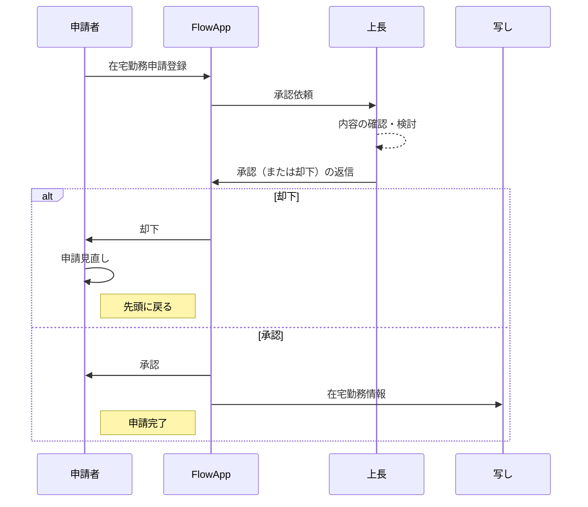
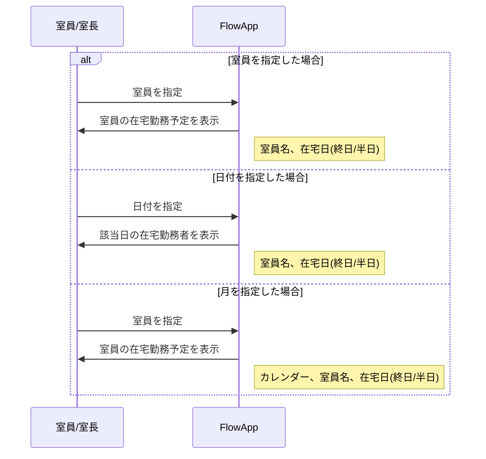
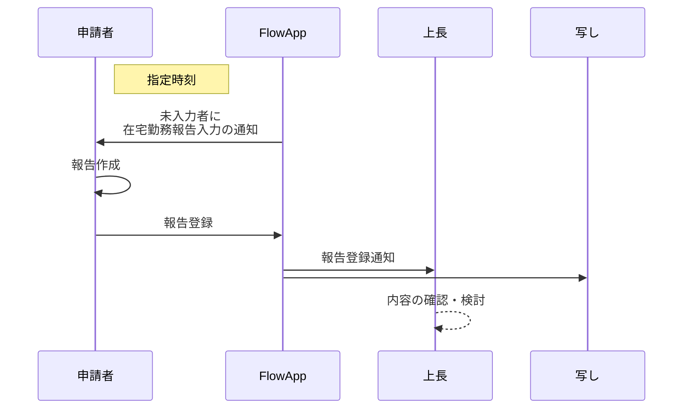

# 社内アプリケーション開発

## 在宅勤務管理アプリ

### 機能

在宅勤務管理アプリの機能について記載する。

#### 機能一覧

1. 在宅勤務申請機能
2. 在宅勤務記録機能
3. 管理・システム連携機能

#### 在宅勤務申請機能

在宅勤務に関する申請を行う機能である。 
以下の機能要件を満足する必要がある。

1. ユーザーは将来の在宅勤務の申請が行える（申請を行うものを申請者とする）
2. 申請者は申請に日付が1日（午前・午後）、複数日指定できる
3. 申請者は申請に理由が入力できる
4. 申請者は申請の承認先が設定できる（承認を行うものを承認者とする）
5. 承認先に設定されたユーザーは申請の承認ができる
6. 承認先に設定されたユーザーは申請の否認ができる
7. 承認先に設定されたユーザーは否認する際、コメントを記載できる
8. 申請者は申請が次承認者に承認されていない場合、取り戻しできる
9. 申請の承認履歴は一定期間保存される
10. 管理者は、申請の承認記録を取得できる（一部のユーザーを管理者とする）
11. 申請者は承認済みの申請を取り下げることができる。
12. 承認者に申請の取り下げが通知できる
13. 申請者は承認済みの申請の日付を変更し、再申請が行える
14. 申請期限制御: 当日や事後の申請に対し、警告表示または理由入力を必須化する
15. 代理承認: 承認者が不在の場合、上位管理者や指定された代理人が承認を行える
16. 代理申請: 本人が操作できない場合、管理者が代理で申請を行える

#### 在宅勤務記録機能

在宅勤務に関する申請を行う機能である。 
以下の機能要件を満足する必要がある。

1. 承認済の在宅勤務日に在宅勤務記録が行える(承認済の在宅勤務を行うユーザーを在宅勤務者とする)
2. 在宅勤務者に在宅勤務記録(開始)の通知が行える
3. 在宅勤務者は在宅勤務記録(開始)に、勤務場所、勤務開始時刻、業務内容が入力できる
4. 在宅勤務者は在宅勤務記録（途中）に、中抜け、特記事項を入力できる
5. 在宅勤務者は在宅勤務記録（終了）に、勤務終了時刻、成果が入力できる
6. 在宅勤務者は在宅勤務記録の変更が行える
7. 在宅勤務記録は一定期間保存される
8. 在宅勤務記録の変更履歴は一定期間保存される
9. 管理者に在宅勤務記録の登録、変更が通知される
10. 入力補助（テンプレート）: 業務内容や理由について、履歴からの引用や定型文選択により入力を補助する
11. 打刻リマインド: 勤務開始時刻や終了予定時刻を過ぎても記録がない場合、プッシュ通知やメールで通知する

#### 管理・システム連携機能

1. カレンダー表示: チームメンバーや管理者が、誰がいつ在宅勤務予定かをカレンダー形式で一覧確認できる
2. データ出力が行える（外部システムとの連携に際し、どのような形式で出力できる必要があるか検討）
3. 帳票出力: （どういう形式の帳票出力が必要か検討）

### 業務フロー設計

#### 在宅勤務申請承認

#### 承認履歴の確認

#### 在宅/出張報告

- 在宅勤務者には定時に(開始/終了)通知
- 定時より前に入力する場合は自身で入力
- 出張者は自身で入力

### データモデル設計

#### ER図（実体関連図）

#### テーブル定義書

#### ステータス遷移図（状態遷移図）

### 画面設計 (UI/UX)

#### 画面一覧（サイトマップ）

#### 画面遷移図

#### 画面レイアウト（ワイヤーフレーム）

### 機能詳細設計（ロジック）

#### 権限定義（権限マトリクス）

#### 入力チェック仕様（バリデーション）

#### 自動処理仕様

#### 帳票・通知・外部出力設計

### インターフェース設計（API）

#### API一覧

#### API定義書（リクエスト/レスポンス）

### システムアーキテクチャ設計

#### システム構成図

#### 技術スタック選定

### 非機能要件定義

#### セキュリティ要件

#### 性能・可用性要件
