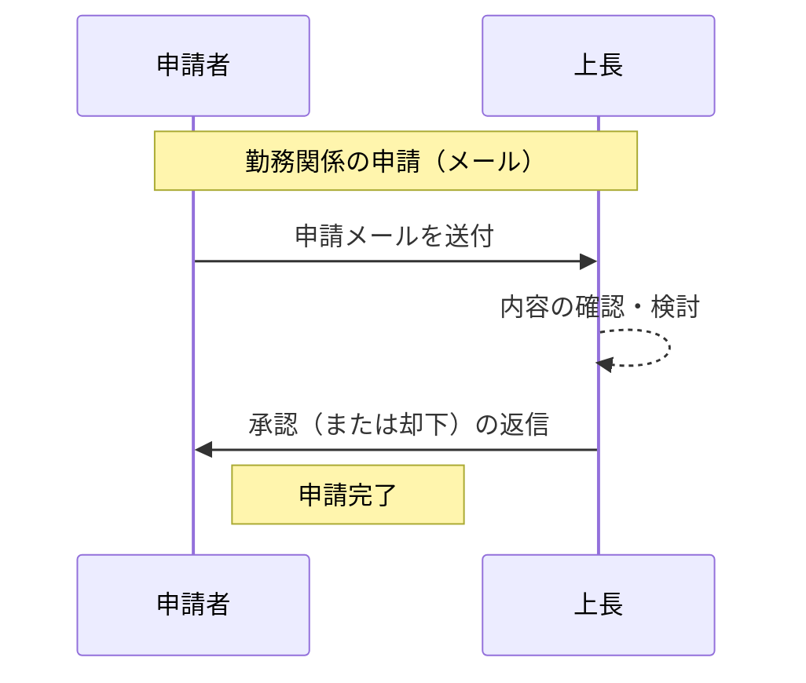
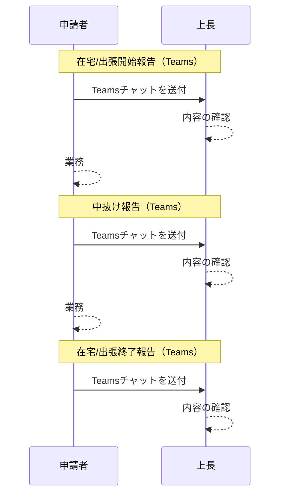
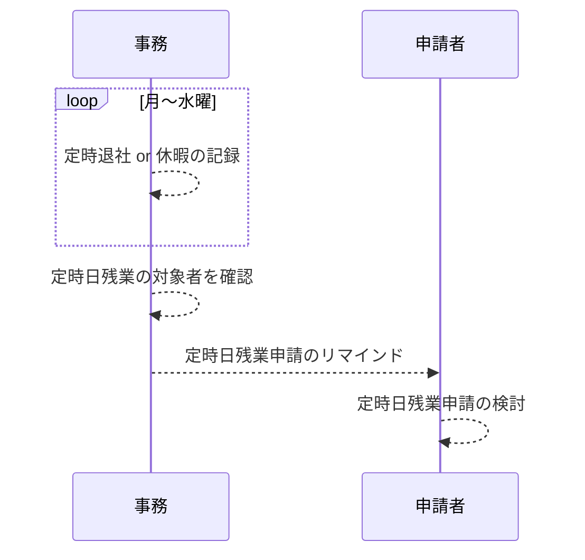
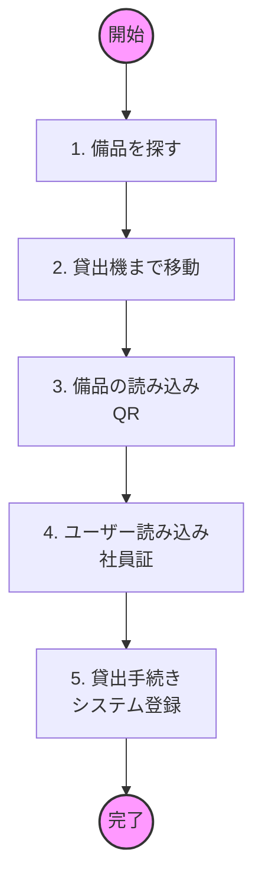

# 既存業務フロー

## 勤務関係の申請

- 対象の申請
  - 在宅勤務申請
  - 休暇申請
  - 休日出勤
  - 特別条項
  - 定時日残業

- 課題
  - 定型のメールを毎回作成する無駄(5分→1分×室員の改善)
  - 上長のメール承認の煩雑さ(1分→30秒×室員の改善　※室員分だけ承認するため)
  - 上長の承認履歴の確認の煩雑さ(2分→30秒×室員の改善　※室員分だけ承認するため)

## 在宅/出張報告

- 課題
  - 定型チャットを毎回作成する無駄(3分→1分×室員の改善)
  - 報告忘れ
  - Teamsのチャットが埋もれ、報告履歴の確認の煩雑さ

## 定時残業申請のリマインド

- 効率化
  - 定時退社 or 休暇の記録(◯秒→◯秒)
  - 対象者へのメール作業(◯秒→◯秒)

## 備品貸出

- 課題
  - 貸出機でしか備品の貸出状況が把握できていない
- 効率化
  - 2 備品保管場所→貸出機(30秒→0秒)
  - 4 ユーザー読み込み(10秒→0秒)
  - ★現品確認(棚卸)を容易にしたい

