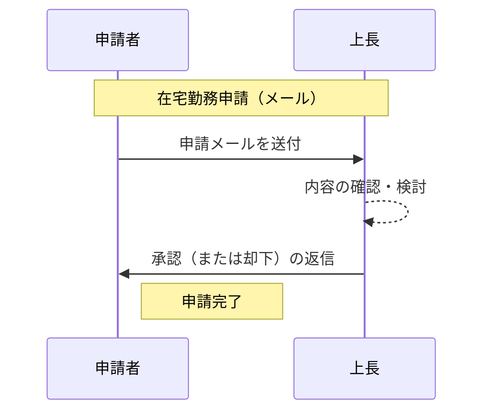
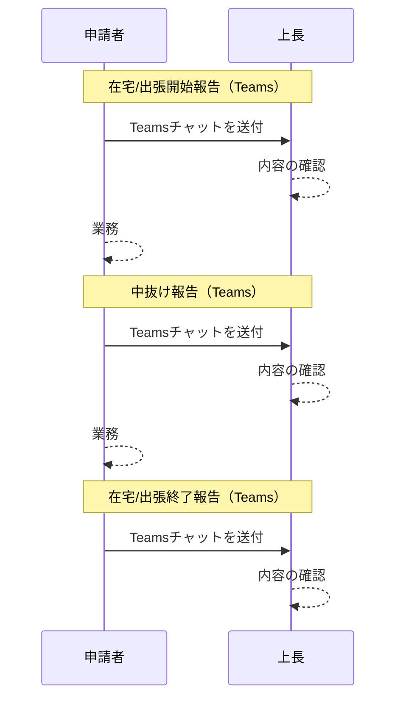
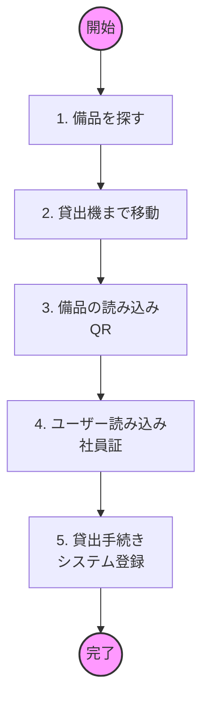

# 既存業務フロー

## 在宅勤務申請

- 課題
  - 定型のメールを毎回作成する無駄(5分→1分×室員の改善)
  - 上長のメール承認の煩雑さ(1分→30秒×室員の改善　※室員分だけ承認するため)
  - 上長の承認履歴の確認の煩雑さ(2分→30秒×室員の改善　※室員分だけ承認するため)

##### 既存業務フロー

## 在宅/出張報告

- 課題
  - 定型チャットを毎回作成する無駄(3分→1分×室員の改善)
  - 報告忘れ
  - Teamsのチャットが埋もれ、報告履歴の確認の煩雑さ

## 備品貸出

- 課題
  - 貸出機でしか備品の貸出状況が把握できていない
- 効率化
  - 2 備品保管場所→貸出機(30秒→0秒)
  - 4 ユーザー読み込み(10秒→0秒)
  - ★現品確認を容易にしたい

