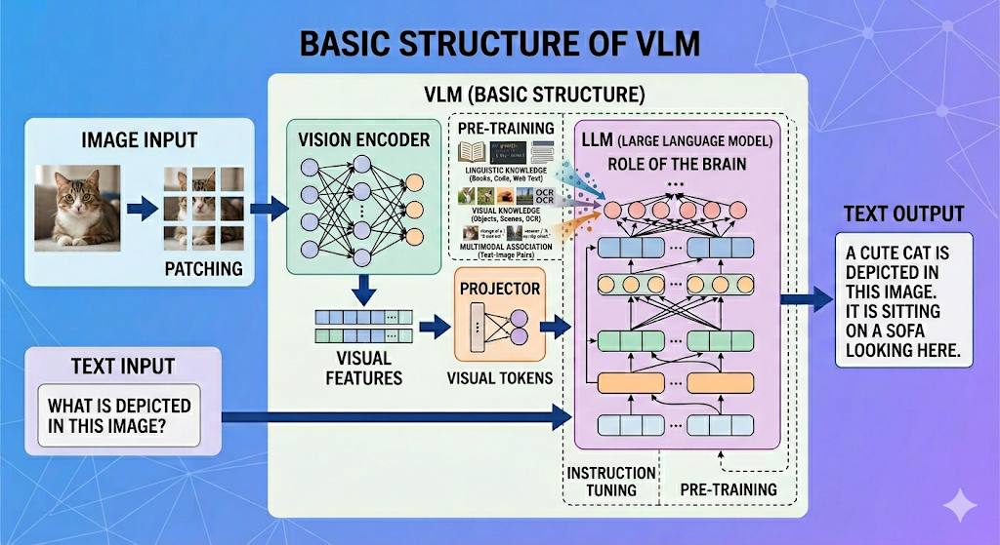

# VLM（Vision-Language Model）サマリ

---

## 1. LLMとVLMの構造の違い

### LLM（Large Language Model）

- **入力**: テキストのみ
- **構造**: Transformerベースのデコーダネットワーク
- **処理**: テキストをトークンに分割 → Transformer層で文脈を解釈 → 次のトークンを自己回帰的に予測
- **本質**: 「言語野」に特化した単一モダリティのモデル

### VLM（Vision-Language Model）

- **入力**: テキスト＋画像（動画）
- **構造**: 3つのコンポーネントから構成される複合アーキテクチャ
- **本質**: 画像のピクセル配列とテキストのトークンを、共通のベクトル空間に統合して処理するマルチモーダルモデル

#### VLMの3つのコンポーネント

| コンポーネント | 役割 | 説明 |
|:---|:---|:---|
| **Vision Encoder**（ViT, CLIP, SigLIP等） | 「目」 | 画像をパッチに分割し、視覚的な特徴ベクトルに変換する |
| **Projector**（mmproj） | 「翻訳機」 | Vision Encoderの出力をLLMが理解できる次元・空間に変換する。2層MLPが最も効果的とされる |
| **LLM本体** | 「脳」 | テキストトークンと変換された視覚トークンを統合的に処理し、回答を生成する |

**なぜProjectorが必要か？**
画像の表現空間と言語の表現空間は次元と意味が全く異なる。Vision Encoderの出力をそのままLLMに渡しても「意味不明なノイズ」にしかならないため、視覚的特徴ベクトルをLLMが扱える**視覚トークン（Visual Tokens）**に翻訳する橋渡し役が必要になる。


---

## 2. VLMの処理の流れ

```
[画像入力]                        [テキスト入力]
    │                                  │
    ▼                                  ▼
┌──────────────┐              ┌──────────────┐
│Vision Encoder│              │ Tokenizer    │
│ (ViT等)      │              │              │
└──────┬───────┘              └──────┬───────┘
       │ 視覚特徴ベクトル              │ テキストトークン
       ▼                              │
┌──────────────┐                       │
│ Projector    │                       │
│ (mmproj)     │                       │
└──────┬───────┘                       │
       │ 視覚トークン                   │
       ▼                              ▼
┌─────────────────────────────────────────┐
│          LLM本体（Transformer）          │
│  視覚トークン＋テキストトークンを統合処理   │
└──────────────────┬──────────────────────┘
                   │
                   ▼
             [テキスト出力]
```

1. **画像の特徴抽出**: Vision Encoderが画像をパッチに分割し、各パッチの視覚的特徴を高次元ベクトルとして抽出
2. **空間の変換（Projection）**: Projectorが視覚特徴ベクトルの次元をLLMの埋め込み空間に合わせて変換
3. **トークン列の統合**: 変換された視覚トークンとテキストトークンを一つのシーケンスとして結合
4. **統合推論**: LLMが結合されたトークン列を処理し、文脈を理解して回答を自己回帰的に生成

---

## 3. VLMの構造の進化

### 第1世代：モジュール結合型（後付け統合）

既存のLLMに画像処理モジュールを後から接続した構造。各コンポーネントが比較的独立している。

| モデル | 特徴 |
|:---|:---|
| **LLaVA** | Vision Encoder + MLPプロジェクター + LLMのシンプルな構成。VLMの基本形を確立 |
| **Llama 3.2 Vision** | LLMの層の間に「Cross-Attention Vision Adapter」を差し込み、必要な時だけ画像特徴を参照 |
| **Qwen 2-VL** | 動的解像度（画像を歪めず元の比率でパッチ化）＋独自プロジェクターで高いOCR性能を実現 |

### 第2世代：ネイティブ・マルチモーダル型（Early Fusion）

事前学習段階からテキストと画像を「ひとつの共通言語」として同時に学習させた統合型アーキテクチャ。

| モデル | 特徴 |
|:---|:---|
| **Qwen 3.5** | 深い融合（DeepStack）で視覚処理層とLLM推論層が深部で直接絡み合う。MoE＋ハイブリッドアテンションにより最大1Mトークンの超長文脈を高速処理 |

### 進化のポイント

| 観点 | 第1世代（モジュール結合型） | 第2世代（ネイティブ型） |
|:---|:---|:---|
| **統合方式** | 後付け接続（プロジェクターで橋渡し） | 初期学習段階から深く融合（Early Fusion） |
| **画像解像度** | 固定サイズ（リサイズで歪む場合あり） | 動的解像度（元の比率と鮮明さを保持） |
| **位置情報** | 単純な1D/2D位置エンコーディング | MRoPE（空間と時間の複雑な位置計算） |
| **効率化** | 標準的なTransformer | MoE（必要な回路だけ動作）＋ハイブリッドアテンション |
| **FTの複雑さ** | 汎用スクリプトでも対応可能 | SWIFT / LLaMA-Factory 等の専用対応が必須 |
| **破滅的忘却リスク** | 比較的低い（コンポーネントが独立） | 高い（深く統合されているためLLM側だけの学習で画像認識力が低下しやすい） |

---

## 4. VLMのファインチューニング手法

### 4.1 代表的なFT手法の一覧

| 手法 | 概要 | 更新対象 | 計算コスト |
|:---|:---|:---|:---|
| **フルファインチューニング（Full SFT）** | モデル全体の重みを更新 | 全コンポーネント | 非常に高い |
| **LoRA / QLoRA** | 低ランク行列を挿入し、少数のパラメータのみ更新 | 任意の層にアダプタ挿入 | 低い |
| **Projector-Only Tuning** | プロジェクター層のみを更新 | Projectorのみ | 最小 |
| **LLM + Projector Tuning** | LLMとプロジェクターを更新（Vision Encoderは凍結） | LLM + Projector | 中程度 |
| **Vision-LoRA** | Vision Encoder側にもLoRAを適用 | Vision Encoder + LLM + Projector | 中〜高 |
| **RLHF / DPO / VPO** | 強化学習による出力品質のアライメント | LLM中心 | 高い |

### 4.2 各手法の得意分野と目的

#### Projector-Only Tuning
- **得意分野**: 新しいドメインへのゼロショット適応、初期アライメント
- **目的**: 最小コストでVision EncoderとLLMの橋渡しを最適化したい場合
- **制限**: 深い推論能力の向上には限界がある

#### LLM + Projector Tuning（最も一般的）
- **得意分野**: 命令チューニング（Instruction Tuning）、チャット応答の品質向上
- **目的**: LLMの推論能力を視覚入力に適応させる。応答スタイルや複雑な質問応答能力を向上
- **例**: 「この画像の内容を説明して」→ より詳細で正確な回答を生成できるようにする

#### Vision + Projector Tuning
- **得意分野**: 特殊ドメインの視覚特徴の学習（医療画像、衛星画像、工業画像など）
- **目的**: CLIPの事前学習データに含まれない視覚パターンを学習させたい場合
- **利点**: LLMの広範な言語知識・推論能力は保持される

#### Vision-LoRA（最新モデル向け）
- **得意分野**: Qwen 3.5等のネイティブ統合型モデルの適応
- **目的**: 画像とテキストが深く統合されたモデルで、片方だけの学習による破滅的忘却を防ぐ
- **背景**: 深い統合モデルではLLM側だけの学習で画像認識力が劣化するため、Vision側にもLoRA適用が推奨

#### LoRA / QLoRA
- **得意分野**: リソース制約下でのFT全般
- **目的**: 単一GPUでも7B〜12Bクラスのモデルを効率的にFT。量子化による精度低下は1〜2%程度
- **適用**: 上記のどの戦略とも組み合わせ可能な汎用的な効率化手法

#### 強化学習ベース（GRPO / VPO）
- **得意分野**: 出力品質の最終最適化、ハルシネーション抑制
- **目的**: SFTだけでは達成できない「推論プロセスの質」と「視覚的正確性」の向上
- **最新動向**: VPO（Visual Preference Optimization）はDPOを大幅に上回る性能を示す

### 4.3 コンポーネント別の凍結・更新戦略まとめ

```
                 Vision Encoder    Projector    LLM
                 ──────────────    ─────────    ───
Projector-Only:     凍結             更新       凍結   → 最小コスト適応
LLM+Projector:      凍結             更新       更新   → 一般的な命令チューニング
Vision+Projector:   更新             更新       凍結   → 特殊ドメイン視覚学習
End-to-End:         更新             更新       更新   → 最高性能（要大規模リソース）
```

---

## 5. 特定ドメイン知識の埋め込みと画像分析・評価に関する研究

### 5.1 リージョンレベルの理解（Region-based Tuning）

画像全体ではなく、特定の関心領域（Region of Interest）を明示的に扱い、部分的な分析・評価を可能にする手法。

| 研究 | 発表年 | ベースVLM / モデル | アプローチ |
|:---|:---:|:---|:---|
| **GPT4RoI** | 2023 | LLaVA (Vicuna + CLIP) | ユーザー指定のBounding Box領域の特徴量を抽出してLLMに入力。特定部位の属性や行動の推論が可能 |
| **RegionGPT** | 2024 | LLaVA / Llama-2系 | 領域レベルの指示チューニングで詳細な領域理解を実現 |
| **CropVLM** | 2025 | モデル非依存 (LLaVA, Qwen-VL等と連携) | 「ズーム」の概念を強化学習で取り入れ、対象VLMのパラメータを凍結したまま細かい解像度が必要なタスク（文書解析等）に対応 |

### 5.2 視覚的プロンプティング（Visual Prompting）

画像に「印」や補助的な視覚情報を加えることで、モデルの注意を特定箇所に向ける手法。学習不要で適用できるものもある。

| 研究 | 発表年 | ベースVLM / モデル | アプローチ |
|:---|:---:|:---|:---|
| **ControlMLLM** | 2024 | LLaVAベース | 学習済みVLMを凍結したまま、学習可能な視覚プロンプト（潜在変数）を注入してテスト時の推論精度を向上 |
| **Explicit Visual Prompts** | 2025 | LLaVA (MedVP-LLaVA) | 医療ドメインにおいて、医師が注目する病変部位を矢印や丸などの明示的なマークアップで強調するプロンプト設計を提案 |

### 5.3 ドメイン知識の注入と破滅的忘却の防止

| 研究 | 発表年 | ベースVLM / モデル | アプローチ |
|:---|:---:|:---|:---|
| **Keep the General, Inject the Specific** | 2025 | 汎用Encoder-Decoder | 構造化ダイアログを用いて、汎用知識を壊さずに専門知識を注入 |
| **DeAR** | 2026 | ViT-B/16 バックボーン系 | Vision Encoderのアテンションヘッドを役割別（汎用・属性・混合）に分類し、汎化ヘッドを保護しつつドメイン特化学習を実現 |
| **FLAIR** | 2025 | CLIPアーキテクチャ | サブキャプション＋テキスト条件付きアテンションプーリングで、3,000万ペアの学習で数十億ペアモデルを凌駕する微細な画像表現を実現 |

### 5.4 実世界の監視・分析への応用例

特定ドメインの画像を分析・評価するために、VLMがどのように活用されているかの具体例。

| ドメイン | 代表的研究・データセット | 発表年 | ベースVLM / モデル | 手法の特徴 |
|:---|:---|:---:|:---|:---|
| **自動車監視** | iFinder / MM-AU | 2025 | Video-LLaVA等 + 外部Vision Encoder | 映像から方向・距離等のシンボリックデータを抽出し、LLMに構造化推論させる。汎用VLMを最大39%上回る精度 |
| **海洋・船舶** | SARChat-Bench-2M | 2025 | Qwen-VL, LLaVA等 (ベンチマーク) | SAR画像の乱流後流パターンから船舶の進行方向を物理法則に基づき推論。81種類の細粒度船舶分類タスクを評価 |
| **航空機** | AVOIDDS / DETR | 2023-2026 | DETR, YOLOv9/v11 (物体検出特化) | eVTOL/ドローンの限られた計算資源下で衝突回避のためのリアルタイム検出（mAP 94.2%）。VLMの推論前の知覚モジュールとして機能 |
| **医療** | Explicit Visual Prompts | 2025 | LLaVA (MedVP-LLaVA) | 病変部位への注意を誘導する視覚プロンプト（バウンディングボックス等の印）を付与した自動生成画像で診断支援 |

### 5.5 推論品質を高める最新メカニズム

特定ドメインの画像分析において、VLMの分析精度と信頼性を高めるための最新の推論手法。

| 手法 | 発表年 | ベースVLM / モデル | 概要・効果 |
|:---|:---:|:---|:---|
| **マルチモーダルCoT** | 2023- | 多岐にわたる | 視覚情報を含めた段階的推論アーキテクチャの総称。ベンチマークにおいて推論精度を最大8.23%向上 |
| **MemVR (Look Twice)** | 2025 | LLaVA, Qwen-VL等 (複数適用可) | 推論中に不確実性が高まった際、視覚トークンを再注入して「二度見」するメモリー空間再遍歴。ハルシネーションを劇的に軽減 |
| **TON (Think-or-Not)** | 2025 | 3B/7Bクラスの各種VLM | GRPO（強化学習）を用い、タスクの難易度に応じて推論の深さを自律的に判断。性能を維持しつつトークン長を最大90%削減 |
| **ReasonEdit / V-DyKnow** | 2026 | LLaVA等の複数VLMで検証 | 人間の論理的推論プロセス（Rationale）を用いてVLMの知識を修正（Knowledge Editing）。長期運用時の知識の鮮度を維持 |