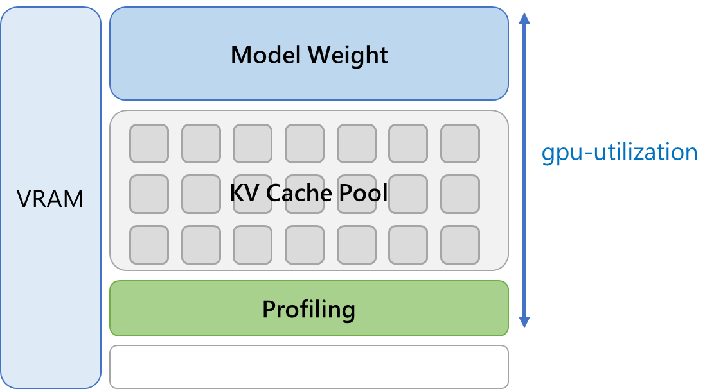
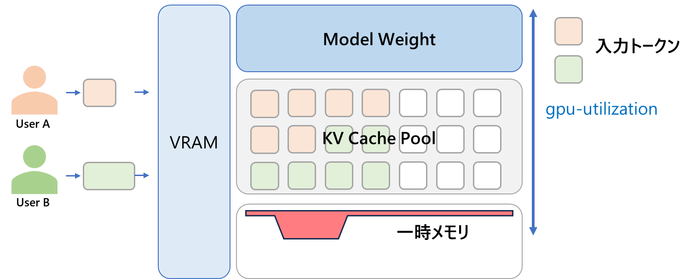
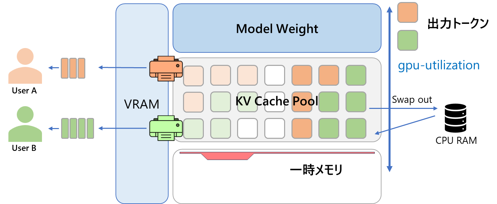
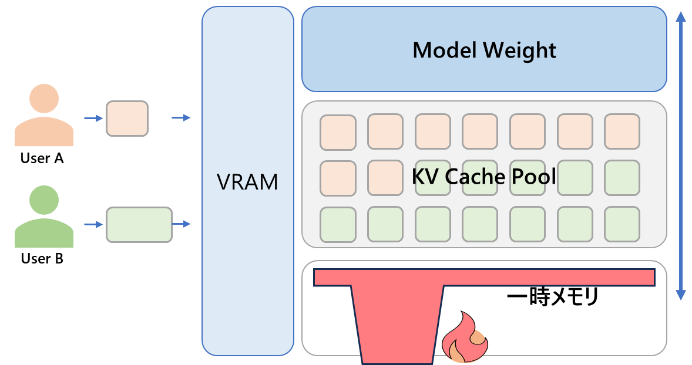
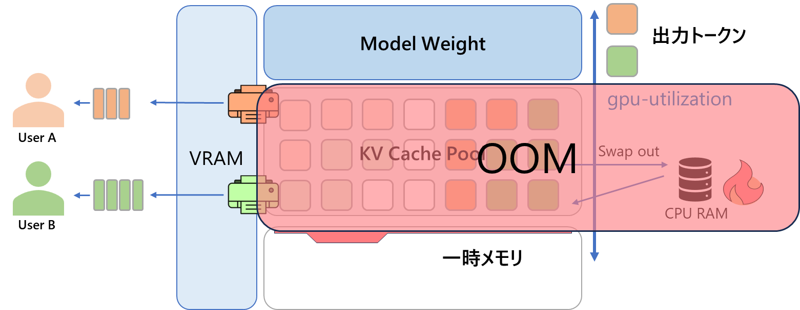

<!-- _class: title -->

# vLLM の VRAM 管理

### KV Cache・OOM・チューニング完全ガイド

---

# アジェンダ

1. vLLM の仕組み（ライフサイクル）
2. 複数ユーザーの同時処理
3. OOM が起きる理由
4. 設定パラメータとその影響
5. チューニングのセオリー

---

# vLLM のライフサイクル概要

```
起動時          →   待機中   →   Prefill   →   Decode
(Startup)          (Idle)      (入力処理)    (出力処理)
```

| フェーズ | 主なVRAM操作 |
|---|---|
| Startup | モデルウェイトロード・プロファイリング・KV Cache確保 |
| Idle | VRAM消費は変化しない |
| Prefill | 入力トークンの並列処理・KV Cacheブロック割り当て |
| Decode | 1トークンごとにKV Cacheスロット消費 |

---

# 起動時（Startup）

## 1. モデルウェイトのロード
- VRAM消費はモデルサイズと**量子化精度**に依存

## 2. プロファイリング
- ダミーデータを流し込み、**実行時に必要な一時メモリのピーク**を見積もる

## 3. KV Cache の一括事前確保
- `gpu_memory_utilization` は vLLM が管理対象として使う VRAM 上限の目安
- profiling で見積もった実行用メモリを差し引いたうえで、残りを KV Cache 用に割り当てる
- KV Cache を FP16 → **FP8** に量子化すると消費が約半分に



---

# Prefill フェーズ（入力処理）

## 一括計算 と ブロック割り当て

- 入力プロンプトのトークンを**並列で一気に処理**
- 生成された KV Cache は小さな**ブロックに分割**して格納

## Paged Attention によるマッピング

- 分割ブロックを確保済みの**空きブロックプール**内に配置
- 連続領域への巨大確保を避け、メモリ断片化の影響を**小さく抑える**

> ここが vLLM の中核技術：物理メモリを仮想的に管理することで効率的な KV Cache 管理を実現



---

# Decode フェーズ（出力処理）

## スロットの消費

- **1 トークン生成ごと**に出力の KV Cache を空きスロットへ割り当て

## ブロックの動的確保

- ブロックが満杯になると**新しい空きブロックを動的確保**
- 長い出力 = より多くの KV Cache ブロックを消費

```
[Prefill]  入力1000トークン → 複数ブロック一括確保
[Decode]   +1トークン → +1スロット消費（ブロック満杯で新ブロック確保）
```


---

# 複数ユーザーの同時処理

## Continuous Batching（イテレーション単位の混載）

- ユーザーA（Prefill中）・ユーザーB（Decode 3トークン目）・ユーザーC（Decode 100トークン目）
- → **1回のGPU計算（イテレーション）に動的に混ぜ込んで処理**

## VRAMプールの共有

- 全ユーザーの KV Cache は起動時に確保した**1つのブロックプールを共有**
- 高負荷時にはプールの奪い合いが発生

---

# キューイングが発生したときの挙動

| 対策 | 内容 |
|---|---|
| **Preemption** | KV Cache が不足したとき、進行中リクエストの一部を退避または再計算対象にして空きを作る |
| **Recomputation** | **V1 の既定**。対象リクエストの KV Cache を破棄し、再開時に入力から計算し直す |
| **Swap** | 必要に応じて KV Cache を CPU 側へ退避する方式。常に既定動作とは限らない |

---

# OOM の原因 ①

## Prefill 時の一時メモリ（Activation Memory）スパイク

**原因**
- `gpu_memory_utilization=0.9` は「残り 10% が常に自由」という意味ではない
- その範囲の中で、重み・実行用メモリ・KV Cache がせめぎ合う
- 大量の長文プロンプトが同時に来ると**一時メモリが瞬間的に急増**

**挙動**
- profiling 時の見積りや運用時のピークを超えると **CUDA Out of Memory クラッシュ**

**対策**
- `max_num_batched_tokens` を下げてバッチサイズを制限
- `gpu_memory_utilization` を `0.9` → `0.8` に下げて余白を確保



---

# OOM / 性能劣化の原因 ②

## CPU RAM 枯渇（CPU offload / swap 利用時）

**原因**
- CPU offload や swap を使う構成で、退避先メモリが不足する
- 大量の退避・再読込が続くと **CPU RAM や帯域**がボトルネックになる

**挙動**
- レイテンシ悪化や退避失敗を招く
- 構成次第では OS 側の OOM に至ることもある



---

# OOM の原因 ③

## 計算リソース飽和による「見かけ上のフリーズ」

**原因**
- VRAM・CPU RAM はギリギリ耐えているが **GPU 演算コアが限界**
- キューに新リクエストが積まれるが GPU が追いつかない

**挙動**
- プロセスは生きているが **TTFT（Time-To-First-Token）が数十秒**に
- クライアント側でタイムアウトエラー → ユーザーには「フリーズ」に見える

---

# パラメータの影響まとめ

| パラメータ | Startup | Prefill | Decode |
|---|:---:|:---:|:---:|
| `max-model-len` を増やす | 影響: 小〜中 | **影響: 特大** | 影響: 大 |
| `max_num_seqs` を増やす | 影響: 大 | 影響: 大 | **影響: 大** |
| `max_num_batched_tokens` を増やす | 影響: 大 | **影響: 特大** | 影響: 中 |

---

# `max-model-len`（最大モデル長）の影響

## 起動時
- vLLM は動的確保のため、旧来エンジンのように起動時に巨大確保はしない
- 旧来方式のように「32k の空枠を全ユーザー分まとめて確保する」挙動ではない
- ただしプロファイリング時の想定メモリが大きくなり **KV Cache プール量が削られる**

## Prefill 時（**影響: 特大**）
- 30k トークン長文プロンプトを一気に並列計算 → 一時メモリが跳ね上がる
- 余白不足で **CUDA OOM（突然死）**

## Decode 時
- 1ユーザーが KV Cache プールを長く占有 → 他リクエストの preemption や待ち時間が増えやすい

---

# `max_num_seqs` / `max_num_batched_tokens` の影響

## `max_num_seqs`（同時処理ユーザー数）
- 大きいほどプロファイリング時に「一時メモリを多く残す」と判定 → KV Cache プール減少
- Decode 時に全ユーザー分のブロックを消費 → **プールが急速に枯渇**

## `max_num_batched_tokens`（1回の GPU 計算に詰め込む総トークン数）
- 大きいほど Prefill を厚く詰められ、**TTFT / throughput には有利**になりやすい
- その分、長文入力が重なると **一時メモリは増えやすい**
- 実態は「ユーザー数 × プロンプト長」の巨大行列計算になり、Activation が跳ねやすい
- 小さくすると ITL 改善に寄りやすいが、Prefill 吞み込み量は落ちる

---

# チューニングのセオリー

## OOM（プロセス突然死）を防ぐ

死因：**Prefill 時の一時メモリスパイク**

- `gpu_memory_utilization` を下げ → 一時メモリの余白を増やす
- `max_num_batched_tokens` を下げ → 1回の計算トークン数を制限

## Swap・タイムアウト（フリーズ）を防ぐ

主因：**Decode 時の KV Cache 圧迫や再計算増加**

- `max_num_seqs` を下げ → 同時処理ユーザー数を絞る
- KV Cache を量子化（FP8）→ プールに格納できるトークン総量を増やす
- `max-model-len` を下げ → 1ユーザーによる独占を防ぐ
- `max_num_batched_tokens` は TTFT / throughput と ITL のトレードオフで調整

---

# まとめ

### vLLM の VRAM 管理は「プール共有」と「動的割り当て」が核心

| 問題 | 主な原因 | 対策パラメータ |
|---|---|---|
| CUDA OOM クラッシュ | Prefill 一時メモリスパイク | `gpu_memory_utilization`, `max_num_batched_tokens` |
| CPU 側の性能劣化 / OOM | CPU offload 先の逼迫 | offload 設定見直し・`max_num_seqs` 削減 |
| フリーズ・タイムアウト | GPU 飽和 / KV Cache 圧迫 / preemption 増加 | `max_num_seqs`, `max_num_batched_tokens`, KV Cache 量子化 |
